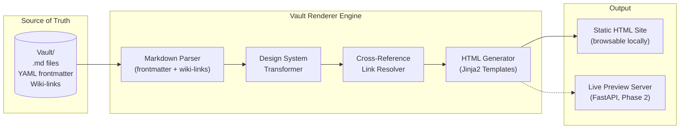

**Back to:** [[Table of Contents#6.1.1. Flagship Applications|Table of Contents]] | [[Project - Nexus Agentic Engine]] | [[Project - Personal Portfolio Website]] | [[Project - Nexus Non-Engine Functionality Upgrades]]

## Goal

Build a **Vault Renderer Engine** — a Python-powered pipeline that reads the raw Obsidian Vault (Markdown + YAML frontmatter + wiki-links) and outputs a fully-linked, premium, browsable HTML site. Obsidian remains the authoring layer and source of truth; the Renderer produces a "read-only luxury interface" for consumption, review, and eventually portfolio demonstration.

**The One-Liner:** *"Obsidian is the database. The Renderer is the frontend."*

---

## Background & Motivation

The HTML prototype of [[To Do List]] revealed a psychological shift: when the Brain stops looking like a folder of `.md` files and starts looking like a **Personal Operating System**, the experience of interacting with your own knowledge fundamentally changes. This project exists to capture and scale that shift.

### Why Not Just Use Obsidian Publish?
- **No control over design system** — locked into their themes and CSS.
- **No agentic integration** — can't wire it into the Engine, agents, or live data.
- **No privacy** — Publish is cloud-hosted; the Vault contains `restricted` and `sensitive` data.
- **No interactivity** — no chat, no agent terminal, no task-checking, no live previews.
- **Cost** — $8/month for a static site you don't fully control.

### Why Not a Full React/Next.js App From Day One?
- Premature complexity. The Vault is ~500+ notes. We need a renderer first, not a SPA framework.
- A Python script that reads Markdown and writes HTML is testable, portable, and pipeable.
- Phase 2 can upgrade to a live server (FastAPI + hot reload) once the design system is proven.

---

## Architecture Overview

### Core Principles
1. **Markdown is the Source of Truth.** The Renderer never writes back to the Vault. It is a one-way read pipeline.
2. **Incremental Rendering.** Only re-render notes that have changed since the last build (via file modification timestamps or git diff).
3. **Design System First.** All visual decisions live in a shared CSS/template system — not hardcoded per-page.
4. **Sensitivity-Aware.** Respect the `sensitivity` YAML field. `restricted` and `sensitive` notes are excluded from public/portfolio renders by default.
5. **Obsidian Parity.** Wiki-links (`[[Note Name]]`), callouts (`> [!note]`), tags, and Mermaid diagrams must render correctly.

---

## Execution Plan

### Phase 1: Static Renderer MVP (`tools/render_vault.py`)
*Goal: Run a command, get a beautiful HTML site of your Vault.*

#### 1.1 Markdown Parsing Engine
- [ ] Parse YAML frontmatter (`aliases`, `tags`, `type`, `sensitivity`) using `python-frontmatter`.
- [ ] Parse Markdown body to HTML using `markdown-it-py` (or `mistune`) with extensions for:
    - [ ] Wiki-link resolution (`[[Note Name]]` → `<a href="note-name.html">`).
    - [ ] Wiki-link with display text (`[[Note Name|Display]]`).
    - [ ] Wiki-link with section anchors (`[[Note Name#Section]]`).
    - [ ] Obsidian callouts (`> [!note]`, `> [!warning]`, `> [!tip]`, `> [!important]`, `> [!success]`, `> [!caution]`).
    - [ ] Task lists (`- [ ]` / `- [x]`).
    - [ ] Mermaid code blocks → `
` (rendered client-side via Mermaid.js CDN).
    - [ ] Embedded images (`![[image.png]]` → `` with correct path resolution).
    - [ ] Embedded PDFs (render as download link or inline `<iframe>`).
    - [ ] External links (open in new tab, subtle icon indicator).
    - [ ] Footnotes.
    - [ ] Tables (GFM-style).
    - [ ] Code blocks with syntax highlighting (Prism.js or Highlight.js CDN).

#### 1.2 Design System & Templates
- [ ] Create a **master CSS design system** (`assets/vault-theme.css`):
    - [ ] Dark mode (slate/indigo/purple palette from the To Do List prototype).
    - [ ] Light mode toggle (CSS custom properties swap).
    - [ ] Typography: `Inter` for body, `Outfit` for headings (Google Fonts).
    - [ ] Glassmorphism cards for sections (`backdrop-filter: blur`).
    - [ ] Smooth gradient accents on headings and active states.
    - [ ] Responsive breakpoints (mobile, tablet, desktop).
    - [ ] Micro-animations: fade-in on scroll, hover lift on cards, checkbox interactions.
    - [ ] Print stylesheet for clean PDF export.
- [ ] Create **Jinja2 HTML templates**:
    - [ ] `base.html` — Shell with `<head>`, nav, footer, theme toggle.
    - [ ] `note.html` — Single note view (frontmatter badge bar, body, backlinks sidebar).
    - [ ] `index.html` — Landing page / dashboard (section cards linking to TOC hierarchy).
    - [ ] `section.html` — Section index listing child notes with metadata previews.
    - [ ] `search.html` — Client-side full-text search (Lunr.js or Fuse.js index generated at build time).
- [ ] Callout styling matching Obsidian's native look (colored left border, icon, background tint).
- [ ] Tag pills rendered from YAML `tags` field with filterable click behavior.

#### 1.3 Cross-Reference & Navigation
- [ ] **Backlinks Panel:** For every rendered note, compute all inbound wiki-links and display as a "Linked Mentions" sidebar.
- [ ] **Breadcrumb Navigation:** Parse folder path to generate `6. Forge > 6.1. Projects > 6.1.1. Flagship Applications > This Note`.
- [ ] **TOC-Aware Sidebar:** Parse `Table of Contents.md` and render as a collapsible, always-visible navigation tree.
- [ ] **Tag Index Page:** Auto-generated page listing all tags and linked notes per tag.
- [ ] **"Graph View" Page:** Generate a D3.js or Cytoscape.js force-directed graph of note connections (wiki-links as edges).

#### 1.4 Build Pipeline
- [ ] CLI interface: `python tools/render_vault.py` with flags:
    - `--output <dir>` — Output directory (default: `build/`).
    - `--section <path>` — Render only a specific Vault section (e.g., `1. The Core`).
    - `--include-sensitive` — Include `sensitive`/`restricted` notes (private builds only).
    - `--watch` — File watcher mode for auto-rebuild on `.md` save.
    - `--serve` — Start a local HTTP server after build (Python `http.server`).
    - `--clean` — Wipe output directory before build.
- [ ] Copy static assets (images, PDFs, fonts) to output directory preserving relative paths.
- [ ] Generate a `search-index.json` at build time for client-side search.
- [ ] Build manifest (`build/manifest.json`) tracking rendered files, timestamps, and link integrity.

### Phase 2: Live Preview Server
*Goal: Save a note in Obsidian → browser auto-refreshes with the rendered version.*

- [ ] **FastAPI server** (`engine/interfaces/web.py`):
    - [ ] Serves the rendered HTML site.
    - [ ] WebSocket endpoint for live reload (browser reconnects on file change).
    - [ ] File system watcher (`watchdog`) triggers incremental re-render + push to connected browsers.
- [ ] **Hot Module Replacement:** Only re-render the changed note and push the updated HTML fragment, not a full page reload.
- [ ] **Integrated into `engine/main.py`:** Add option 4 to Mission Control menu: `🌐 Launch Vault Dashboard`.

### Phase 3: Interactive Features
*Goal: The rendered site becomes a two-way interface, not just a read-only export.*

- [ ] **Task Checking:** Click checkboxes in the HTML → writes back to the source `.md` file via the FastAPI server.
- [ ] **Inline Editing:** Double-click a paragraph → edit in-place → saves back to `.md` (CodeMirror or Monaco editor).
- [ ] **Agent Chat Panel:** Slide-out panel wired to `/ask_brain` (the Librarian Agent) via WebSocket.
- [ ] **Quick Capture Widget:** Floating button to create a new note directly from the browser → drops into `0. Inbox`.
- [ ] **HITL Review Queue:** Surface pending agent decisions (from [[Project - Nexus Agentic Engine#Section 2 GUI|Engine Section 2]]) with approve/reject buttons.

### Phase 4: Portfolio & Public Mode
*Goal: Generate a sanitized, deployable version for portfolio demos and interviews.*

- [ ] **Public Render Profile:** A `render_profiles.yaml` config that defines which sections/tags/sensitivity levels to include.
    - `private` profile: Full Vault, all sensitivity levels. Local only.
    - `portfolio` profile: Only `public` notes, curated sections (Career, Projects, Library), synthetic data for medical demos.
    - `demo` profile: Minimal set for live interview walkthroughs.
- [ ] **Redaction Engine:** Auto-strip or replace `sensitive`/`restricted` content with `[REDACTED]` placeholders.
- [ ] **Static Deploy:** One-command deploy to GitHub Pages, Vercel, or Netlify for the `portfolio` profile.
- [ ] **Branded Landing Page:** Custom hero section with name, avatar, and "Explore My Second Brain" CTA.
- [ ] **"Wow Factor" Pages:**
    - [ ] Interactive knowledge graph visualization.
    - [ ] Animated statistics: total notes, total links, domains covered, agent runs this month.
    - [ ] Timeline view of the Vault's evolution (git history visualization).

### Phase 5: Advanced Rendering
*Goal: Handle every edge case and become the definitive Vault interface.*

- [ ] **PDF Rendering:** Generate per-note or per-section PDFs with the design system applied (WeasyPrint or Playwright).
- [ ] **Dataview-like Queries:** Parse inline queries (e.g., list all `type: project` notes with `tags: Nexus`) and render as dynamic tables.
- [ ] **Transclusion:** Render `![[Embedded Note]]` by inlining the referenced note's content.
- [ ] **Audio Player:** For notes with linked `.mp3` files (from `generate_podcast.py`), embed an inline audio player.
- [ ] **Image Gallery:** For image-heavy sections (Memories Log Images), render as a responsive masonry grid.
- [ ] **Diff View:** Show recent changes to a note (git diff integration) as a colored inline diff.
- [ ] **Multi-Vault Support:** Render multiple Vaults (e.g., a shared family health vault + personal vault) with cross-linking.

---

## Tech Stack

| Component | Technology | Rationale |
|---|---|---|
| Markdown Parsing | `markdown-it-py` | Extensible, fast, plugin ecosystem for custom syntax |
| Frontmatter | `python-frontmatter` | Clean YAML extraction |
| Templating | `Jinja2` | Industry standard, already in the Python ecosystem |
| CSS Framework | Vanilla CSS (custom design system) | Full control, no bloat, matches the prototype aesthetic |
| Typography | Google Fonts (Inter + Outfit) | Proven pairing from the To Do List prototype |
| Mermaid Diagrams | Mermaid.js (CDN) | Client-side rendering, zero build complexity |
| Code Highlighting | Prism.js (CDN) | Lightweight, supports all languages |
| Search | Fuse.js (client-side) | No server needed for Phase 1, fuzzy matching |
| Graph Visualization | D3.js or Cytoscape.js | Force-directed graph, interactive zoom/filter |
| Live Server (Phase 2) | FastAPI + Uvicorn | Already in the Engine ecosystem, WebSocket support |
| File Watching | `watchdog` | Cross-platform filesystem event monitoring |
| PDF Export (Phase 5) | WeasyPrint or Playwright | CSS-to-PDF with full design system support |

---

## Design System Specification

### Color Palette (Dark Mode — Primary)
| Token | Value | Usage |
|---|---|---|
| `--bg-color` | `#0f172a` | Page background |
| `--surface-color` | `rgba(30, 41, 59, 0.7)` | Card/section backgrounds |
| `--border-color` | `rgba(255, 255, 255, 0.1)` | Subtle borders |
| `--text-primary` | `#f8fafc` | Headings, body text |
| `--text-secondary` | `#94a3b8` | Metadata, timestamps |
| `--accent-primary` | `#818cf8` | Links, interactive elements |
| `--accent-secondary` | `#c084fc` | Gradient endpoints, hover states |
| `--success` | `#4ade80` | Completed items, Trophy Case |
| `--warning` | `#fbbf24` | Callouts, deadlines |
| `--error` | `#f87171` | Broken links, errors |

### Callout Mapping
| Obsidian Type | Color | Icon |
|---|---|---|
| `> [!note]` | Blue (`#60a5fa`) | ℹ️ |
| `> [!tip]` | Cyan (`#22d3ee`) | 💡 |
| `> [!important]` | Purple (`#a78bfa`) | ⚡ |
| `> [!warning]` | Amber (`#fbbf24`) | ⚠️ |
| `> [!caution]` | Red (`#f87171`) | 🔴 |
| `> [!success]` | Green (`#4ade80`) | ✅ |

---

## Relationship to Other Projects

- **[[Project - Nexus Agentic Engine]]:** The Renderer's Phase 3 (Interactive Features) directly implements Section 2 of the Engine roadmap (GUI / HITL Interface). The Renderer is the *visual layer* that the Engine's agents write to and the human reviews through.
- **[[Project - Personal Portfolio Website]]:** Phase 4 (Portfolio Mode) could *replace* or *feed into* the Portfolio Website. Instead of building a separate Next.js site, the Portfolio Website could simply be the Renderer's `portfolio` profile deployed to Vercel.
- **[[Project - Nexus Non-Engine Functionality Upgrades]]:** The Renderer absorbs several items from the Non-Engine backlog (Dashboard, Vault Explorer, better note viewing).

---

## Tasks

- [ ] Research and select Markdown parsing library (`markdown-it-py` vs `mistune` vs `marko`).
- [ ] Build wiki-link parser (regex + vault file index for resolution).
- [ ] Build callout parser (Obsidian `> [!type]` syntax).
- [ ] Create the CSS design system (`vault-theme.css`) from the To Do List prototype.
- [ ] Create Jinja2 base template with responsive nav and theme toggle.
- [ ] Implement `render_vault.py` CLI with `--output` and `--section` flags.
- [ ] Render the full `1. The Core` section as a proof of concept.
- [ ] Add backlinks computation and sidebar rendering.
- [ ] Generate a client-side search index.
- [ ] Implement `--watch` mode with file system observer.
- [ ] Build the FastAPI live preview server (Phase 2).
- [ ] Wire the Agent Chat Panel to the Librarian Agent (Phase 3).

## Materials Needed

- [ ] `python-frontmatter` — YAML parsing.
- [ ] `markdown-it-py` — Markdown → HTML conversion.
- [ ] `jinja2` — HTML templating.
- [ ] `watchdog` — File system watching (Phase 2).
- [ ] `fastapi` + `uvicorn` — Live server (Phase 2).
- [ ] Google Fonts CDN link (Inter + Outfit).
- [ ] Mermaid.js CDN link.
- [ ] Prism.js CDN link.
- [ ] Fuse.js CDN link.

## Reference Links

- [Obsidian Help: Callouts](https://help.obsidian.md/Editing+and+formatting/Callouts)
- [markdown-it-py Documentation](https://markdown-it-py.readthedocs.io/)
- [Jinja2 Documentation](https://jinja.palletsprojects.com/)
- [Mermaid.js Live Editor](https://mermaid.live/)
- [Fuse.js Documentation](https://www.fusejs.io/)
- The original prototype: `Vault/0. Inbox/To Do List.html`

---
*Created: 2026-05-15*
