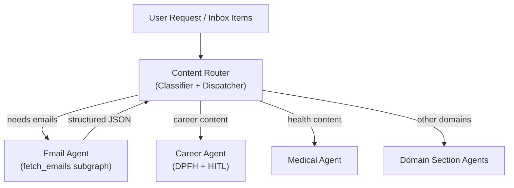

**Engine Directory:** `engine/agents/router`

**Back to:** [[Table of Contents#6.1.2. Agentic R&D|Table of Contents]] | [[Project - Nexus Agentic Engine]] | [[Project - Nexus Demo]]

# Overview

The Universal Content Router Agent acts as the single entry point and orchestrator for the Nexus Agentic Engine. It is responsible for classifying incoming user requests, commands, and captured content, and dispatching them to the appropriate domain-specialized agents (e.g., [[Project - Career Agent|Career Agent]], Medical Agent, etc.).

When dealing with inputs that require external fetching, the Content Router invokes dedicated I/O subgraphs. For example, it calls the [[Project - Email Agent|Email Agent]] via the `fetch_emails(query)` compiled subgraph to ingest email data before classifying and routing the individual items.

## Architecture

# Objectives

- **Single Entry Point:** Replaces legacy `/audit_inbox` and manual capture tools to become the front door of the Nexus Engine.
- **Classification & Routing:** Accurately classifies multi-modal input (text, emails, captured content) into strict domain categories.
- **Compiled Subgraph Orchestration:** Defers external data fetching to specialized I/O agents (like the Email Agent).
- **Extensible Dispatch:** Easily scale to new domain agents (Finance, Hobby, Medical) by expanding the routing logic.

# Tasks

## Core Routing
- [x] Define Router prompt and classification rules.
- [x] Register `fetch_emails()` tool on the Router.
- [x] Build Router eval dataset (Target: 100% classification accuracy).
- [ ] Connect the Universal Content Router to the universal inbox to process unsorted items automatically.
    - **Open Questions:** Should `/process_capture` replace `/audit_inbox`, or should `/audit_inbox` be a batch process that calls `/process_capture` on a loop for everything in the inbox? Are there other major "domain triggers" needed? (e.g. Finance, Car Maintenance logging).

## Universal Content Capture (Multi-Source Ingest)
Much of the "Second Brain" input starts as external content across various platforms (newsletters, Tweets, Reddit, research papers). Currently high-friction manual process leading to "inbox rot."
- [ ] **Option A: Custom Multi-Source Ingest Tool** (`tools/content_ingest.py`):
    - [ ] **Email:** Connects to IMAP (e.g., Gmail) to fetch emails with a specific label (e.g., `#to-vault`).
    - [ ] **Social (Twitter/Reddit):** Scripts to pull full threads from a URL, preserving author context and media links.
    - [ ] **PDF/Paper:** Auto-ingest from a watched "Capture" folder on the filesystem.
- [ ] **Option B: Modern Low-Friction Methods** (2026 Research):
    - [ ] **Official Obsidian Web Clipper:** Use the native clipper with custom templates for Tweets, Reddit posts, and Emails.
    - [ ] **Readwise Reader / Raindrop.io:** Leverage "read it later" services with robust Obsidian sync plugins.
    - [ ] **Browser Automation:** A simple context-menu "Send to Brain" action.
- [ ] The `/audit_inbox` workflow processes these automatically once they land in the inbox.

## Specialized Ingestion Capabilities
- [ ] **Quick Capture Auto-Processing:** Integrates unsorted inbox items into the weekly review pipeline to prevent "inbox rot."
    - [ ] Integrate Quick Capture processing into the `/weekly_review` workflow.
    - [ ] Add a Dataview query to the Dashboard showing Quick Capture item count — visible guilt nudge.
    - [ ] Stretch goal: a `tools/inbox_alert.py` script that warns if Quick Capture has more than 5 items.
- [ ] **Automated Deep-Dive Researcher:** Autonomous web scraping and primer generation for new ideas dropped into the inbox overnight.
    - [x] **Foundation Built:** The `tools/read_webpage.py` tool is already built and handles Trafilatura-based markdown extraction from single URLs. This will serve as the core ACI tool for the researcher agent.
    - [x] **Foundation Built:** The `tools/read_email.py` tool is already built — fetches a single email by IMAP UID and returns clean markdown (subject, from, date, body). Analogous to `read_webpage.py`; the atomic ingest layer for the email capture pipeline.
- [ ] **Vision & Image Ingestion:** Integrate a vision-capable model (GPT-4o, Claude, or local LLaVA) as a tool for content ingestion. Screenshot/whiteboard OCR + summarization into vault notes. Photo → structured note pipeline.

# Resources

- [[Project - Nexus Agentic Engine]]: Master architecture reference.
- [[Project - Email Agent]]: Email I/O compiled subgraph called by the Router.
- [[Project - Career Agent]]: Example domain agent dispatched by the Router.
- [[Project - Nexus Demo]]: Demo pipeline demonstrating the Router in action.
