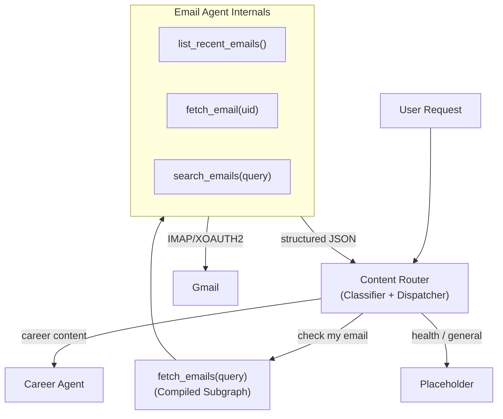

**Engine Directory:** `engine/agents/email`

**Back to:** [[Table of Contents#6.1.2. Agentic R&D|Table of Contents]] | [[Project - Nexus Agentic Engine]] | [[Project - Nexus Demo]]

# Overview

The Email Agent is a LangGraph-powered compiled subgraph that encapsulates all email I/O — connecting to Gmail via IMAP/XOAUTH2, fetching recent emails, searching by keyword/sender/description, and parsing results into structured JSON. It is invoked by the Content Router as a tool (`fetch_emails(query)`) following the same **compiled subgraph pattern** the Career Agent uses to call the Librarian (`ask_librarian(query)`).

The Email Agent handles all IMAP complexity so the Router doesn't have to. It returns clean, structured JSON arrays of `{uid, subject, sender, date, body}` objects that the Router can immediately classify and dispatch.

The foundational plumbing already exists in `engine/tools/email_tool.py` (IMAP connection, MIME parsing, HTML stripping, header decoding) and `engine/core/google_auth.py` (OAuth2 token management). This project migrates that code into `engine/agents/email/`, wraps it in a LangGraph ReAct agent with tool-calling, and compiles it as a subgraph tool for the Router.

## Architecture



This mirrors the established inter-agent pattern:
```
Career Agent  → ask_librarian(query)  → Librarian subgraph  → returns string
Content Router → fetch_emails(query)  → Email Agent subgraph → returns JSON
```

# Objectives

- Build a LangGraph ReAct agent that handles all email I/O in an isolated subgraph
- Provide tools for listing recent emails, fetching by UID, and searching by keyword/sender/description
- Return structured JSON to the Router for classification and dispatch
- Support both live IMAP mode and a `--mock` mode using pre-saved `.eml` files
- Build a dedicated evaluation suite validating parsing accuracy and search translation

# Tools (Internal to Email Agent)

| Tool | Source | Description |
|---|---|---|
| `list_recent_emails(count)` | Migrated from `email_tool.py` | Lists the N most recent emails (subject, sender, date, UID) |
| `fetch_email(uid)` | Migrated from `email_tool.py` | Fetches a single email by UID, returns parsed markdown body |
| `search_emails(query)` | New | Translates natural language into IMAP SEARCH criteria (FROM, SUBJECT, BODY, SINCE) |

## Public API (Called by Router)

```python
def fetch_emails(query: str, mode: str = "live") -> list[dict]:
    """
    Compiled subgraph entry point. Called by the Router as a tool.
    
    Args:
        query: Natural language like "recent job emails" or "email from Bobby about take-home"
        mode: "live" for real IMAP, "mock" for sample .eml files
    
    Returns:
        List of {uid, subject, sender, date, body} dicts ready for Router classification.
    """
```

# Tasks

## Core Implementation
- [x] Create `engine/agents/email/` directory structure (`__init__.py`, `agent.py`, `tools.py`, `prompts.py`) (2026-06-01)
- [x] Migrate and refactor `engine/tools/email_tool.py` → `engine/agents/email/tools.py` (2026-06-01)
- [x] Implement `search_emails` tool with IMAP SEARCH query translation (2026-06-01)
- [x] Build `EmailAgentState` and LangGraph ReAct graph (2026-06-01)
- [x] Compile as subgraph and expose `fetch_emails(query)` public API (2026-06-01)
- [~] Implement `--mock` mode reading from `engine/agents/email/sample_emails/` *(Skipped: Validated live against the "Jobs" folder directly)*
- [x] Register `fetch_emails` as a tool on the Router in `engine/agents/router/agent.py` (2026-06-01)

## Evaluation Suite
- [x] Create `engine/agents/email/evals/` with `dataset.json` and `runner.py` (2026-06-01)
- [x] Test cases for:
  - Correct email parsing (subject, sender, body extraction)
  - Search query → IMAP SEARCH translation accuracy
  - ~~Mock mode parity with live mode output format~~
  - Edge cases: HTML-only emails, multipart attachments, encoded headers

## Demo Integration
- [~] Save 3-4 real job-related emails as `.eml` files for the mock dataset *(Skipped)*
- [x] End-to-end smoke test: User → Router → Email Agent (subgraph) → Router (classifies) → Career Agent (2026-06-01)

# Resources

- `engine/tools/email_tool.py` — Existing IMAP fetch/parse infrastructure (to be migrated)
- `engine/core/google_auth.py` — Google OAuth2 token management
- [[Project - Nexus Agentic Engine#Section 4 Content Ingestion & Routing|Parent Architecture: Content Ingestion & Routing]]
- [[Project - Nexus Demo]] — Interview demo packaging strategy
- [[Project - Librarian Agent]] — Reference implementation of the compiled subgraph pattern
