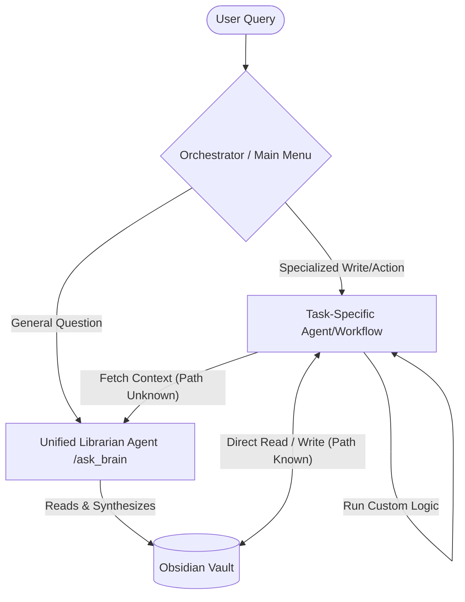

---
aliases:
  - Librarian
  - ask_brain
  - Agentic File Navigator
tags:
  - projects
  - ai-agents
  - langgraph
  - pkm
  - file-system
type: overview
status:
archived: false
---
**Engine Directory:** `engine/agents/librarian`

**Back to:** [[Table of Contents#6.1.2. Agentic R&D|Table of Contents]] | [[Project - Nexus Agentic Engine]]

## Overview
Build an Agentic Librarian (File-System Navigator) natively integrated into the Nexus.0 vault. This agent, triggered by Agentic instruction `/ask_brain` or CLI command `ask-brain`, replaces the deprecated ChromaDB RAG system. It allows semantic querying across all vault notes by dynamically reading the local filesystem using LangGraph tool-calling, completely preserving the Zettelkasten hierarchy without the limitations of Vector Context Fragmentation.

## Build Order

Before the Librarian is treated as complete infrastructure for the [[Project - Nexus Agentic Engine]], it needs to become measurable, auditable, and boringly reliable. The remaining build slice is the **Engine Trust Layer v0** around `/ask_brain`, so future agents can safely delegate vault-reading work to it.

1. [x] **Architecture Pivot from Vector RAG**
	- Deprecated the ChromaDB-first RAG approach for general vault questioning.
	- Adopted agentic file navigation to preserve folder hierarchy, full-note context, and wiki-link neighborhoods.
	- Kept the pivot grounded in the [[Context Fragmentation]] problem identified during earlier retrieval work.
2. [x] **Deterministic Vault Tools**
	- Built `read_toc()` for orientation against `Table of Contents.md`.
	- Built `read_note(note_path)` for exact file reads by relative path or unique note name.
	- Built `search_vault(keyword)` for explicit keyword search across markdown notes.
	- Ensured tools skip `Vault/.git` so the nested private repository is not traversed.
3. [x] **LangGraph ReAct Agent**
	- Created the `engine/agents/librarian/` module.
	- Wired the Librarian as a LangGraph loop with tool-calling and conditional tool routing.
	- Added the system prompt requiring TOC orientation, note navigation, wiki-link traversal, grounded synthesis, and citations.
4. [x] **Engine Integration**
	- Updated `engine/main.py` so direct text queries call the Librarian through `ask_librarian()`.
	- Kept the mission-control menu path for interactive text querying.
	- Preserved voice and Telegram entry points as interfaces that can call the same reader pathway.
5. [x] **Workflow and Documentation Alignment**
	- Updated `/ask_brain` documentation to describe agentic vault navigation rather than vector indexing.
	- Registered the Librarian inside the parent [[Project - Nexus Agentic Engine]] roadmap.
	- Moved this project note out of Archive and re-linked it from the TOC.
6. [x] **Golden Dataset + Eval Runner**
	- Create a few vault-specific Q&A cases covering the questions the Brain is actually expected to answer.
	- Add an `engine/evals/` runner that executes `ask_librarian()` against those cases.
	- Track whether answers are grounded, cite the right files, and avoid hallucinating when the vault does not contain the answer.
7. [x] **Structured Run Logs**
	- Write lightweight JSONL records for each query: timestamp, query, final status, cited sources, errors, and tool calls if available from the graph trace.
	- Use these logs as the seed for the future [[Project - Nexus Agentic Engine#Observability & Trust|Decision Audit Trail]] and monthly Brain metrics.
8. [x] **Librarian Contract Tightening** (2026-05-19)
	- Rewrote `prompts.py` with a strict response contract: mandatory `[Sources]` section on every response, explicit `[Not Found]` state for unsupported answers.
	- Encoded **Cross-Domain Awareness** into the system prompt: the agent now knows the brain's dual-structure (`6.1. Projects` = implementation, `6.2. Library` = theory) and is instructed to check BOTH for any technical question. Full vault section map included.
	- Updated `agent.py` log parser to detect `not_found` status and skip `(none)` source markers.
	- **Eval Results:** 7/7 golden dataset cases passed (avg 9.7/10). Cross-domain behavior confirmed on Case 1 (agent searched both 6.1 and 6.2). Negative case (Case 7) correctly used `[Not Found]` format.
9. [x] **Phase 2 Search: Tree-Based Navigation & Targeted Grep (Agentic ls)** (2026-05-21)
	- Pivoted away from brute-force `search_vault()` across the entire vault.
	- Built `get_vault_structure(path=None)` tool as an "Agentic `ls`": returns full recursive folder tree (no files) when called at root for cheap orientation, or folders + files when drilling into a specific subtree path. Respects `IGNORE_DIRS` from `constants.py`.
	- Updated `search_vault(keyword, path, tags)` to accept an optional target folder path for fast, targeted subtree grep, and an optional `tags` list for YAML frontmatter filtering (lightweight regex parser — full `PyYAML` migration tracked as a future parent project item).
	- Rewrote the system prompt to enforce a **navigate-first, search-second** strategy with **multi-targeted searches** on separate paths for cross-domain queries. Full-vault search is explicitly a last resort.
	- **Dynamic Structure Injection:** The root vault folder tree is generated at query time and injected directly into the system prompt via a `{vault_structure}` placeholder. The agent sees the full folder layout on its first turn without wasting an LLM round-trip on `get_vault_structure()`. Stays fresh automatically — no hardcoded paths to maintain.
	- **Token Usage Tracking:** Added `usage_metadata` extraction from LangChain AI messages. Both `run_logs.jsonl` and the eval runner now log `prompt_tokens`, `completion_tokens`, and `total_tokens` per query.
	- All existing Golden Dataset eval cases continue to pass.

## 🏗️ Architecture

The system uses a LangGraph ReAct (Reasoning and Acting) loop to organically navigate the vault:
-  **Query:** User asks a natural language question.
-  **Orientation:** Agent calls `get_vault_structure(path=None)` to view the definitive directory tree (acting as an "Agentic `ls`" to save context tokens), or `read_toc()` for human context and descriptions.
- **Navigation:** Agent dynamically chooses to call `read_note(note_path)` for exact files, or `search_vault(keyword, path=...)` to perform a targeted, high-speed grep on a specific subtree. If a query spans multiple domains, the Agent executes multi-targeted searches.
- **Graph Traversal:** The Agent reads wiki-links (`[[Note Name]]`) inside the notes and recursively traverses the relevant files, naturally jumping across the folder hierarchy to gather cross-domain context.
- **Synthesis & Response:** Output a grounded answer with citations to the exact files read.

### ⚠️ Cross-Domain Retrieval: The Three Mechanisms
The Agent does NOT automatically know to check multiple folders. Cross-domain coverage depends on three explicit mechanisms, in order of reliability:

1. **System Prompt Encoding (Most Reliable):** `prompts.py` explicitly instructs the Agent to always check both `6.1. Projects` AND `6.2. Library` for technical topics. Without this, the Agent defaults to the first plausible folder it finds.
2. **Wiki-Link Traversal (Organic):** If a project note contains a `[[link]]` to a library note, the Agent follows it naturally. This is why disciplined Zettelkasten linking is a performance feature, not just aesthetics.
3. **Inference (Unreliable, Do Not Depend On):** The LLM may "guess" it needs multiple sources, but this is non-deterministic and should never be treated as a guarantee.

### Shared Infrastructure (The Hybrid Librarian Architecture)

The Librarian is configured as a **compiled subgraph (live Agentic tool)** (e.g., `ask_librarian(query)`) rather than just raw python utilities. This encapsulates the complex traversal rules (TOC navigation, wiki-link traversal, and token-saving tree structures) in one place.

The Librarian's primary role is as the **cross-domain search escalation service**. Domain-specific agents (like the Career Agent or Grocery Agent) have their own direct local filesystem tools scoped to their domain folder. They receive a pre-hydrated directory listing via `{domain_files}` injection before every LLM call, and their `required_context` dependencies are resolved deterministically at startup. The Librarian is invoked only when:
1. A declared `required_context` dependency needs cross-domain data (resolved *before* the LLM wakes up).
2. The LLM encounters an unexpected cross-domain question at runtime and needs to search outside its own folder.



## 📂 Project Structure

This architecture separates the core vault navigation tools from the agent's logic:
```text
Nexus/
└── engine/
    ├── tools/
    │   └── vault_tools.py          # Shared LangChain @tool definitions (read_toc, get_vault_structure, read_note, search_vault)
    └── agents/
        └── librarian/           # General-purpose, full-vault reader (Librarian Agent)
            ├── agent.py            # LangGraph ReAct state machine (exposes ask_librarian tool)
            └── prompts.py          # System instructions for Vault Navigation
```
