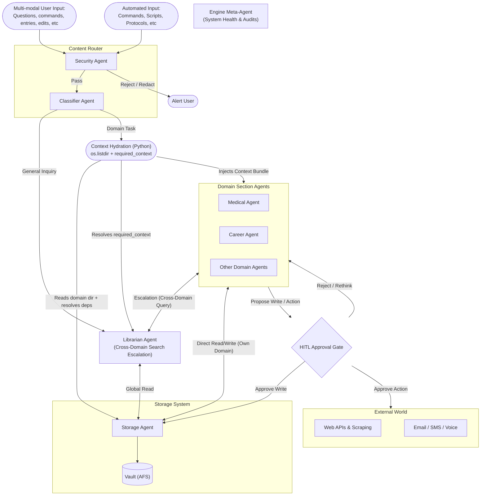

---
aliases:
  - LangGraph Agents
  - Nexus Agents
  - Agentic Build Plan
  - Nexus Agentic Engine
  - Brain OS
tags:
  - projects
  - ai-agents
  - langgraph
  - pkm
  - Nexus
type: overview
---
**Engine Directory:** `/engine/`

[[Table of Contents#6.1.2. Agentic R&D|TOC]] | Related: [[Project - Nexus Non-Engine Functionality Upgrades]]

> **Quick Nav:** [[#Overview]] · [[#Objectives]] · [[#Build]] · [[#Evolutionary Strategy Keeping Pace with the Industry|Evolutionary Strat]] · [[#Architecture Notes]] · [[#Engineering Evolution From Scripts to Application|Project Evolution]] · [[#Resources]] · [[#Appendix Engine Architecture Sketch Mermaid|Diagram]]
# Overview

Nexus is currently a personal knowledge management system built on Obsidian and the Zettelkasten methodology. It stores everything — medical records, career strategy, learning notes, journal entries, project plans — as interconnected markdown files in a local Vault. Today, the Vault is read and edited manually in Obsidian, with semi-autonomous assistance from an agentic IDE (Google Antigravity) that executes markdown-defined workflows and skills.

The **Agentic Engine** is the next evolution: a suite of LangGraph-powered agents that operate natively on the Vault as an **Agentic File System (AFS)** — reading, writing, routing, and reasoning over its contents without external cloud dependencies. Domain-specialized agent teams (Career, Medical, Psych, Tutor, Home Planner, Grocery Shopper, etc) work through a central Content Router, with a shared memory architecture (working, episodic, procedural), structured observability, and mandatory human-in-the-loop governance. The goal is a local-first, privacy-preserving **life operating system** — one that autonomously ingests information, maintains its own health, tracks longitudinal human data, and surfaces the right knowledge at the right time, while keeping the human in control of every irreversible decision.

# Objectives
- Nexus's memory is currently inside the Vault and can be viewed and edited manually in Obsidian. It currently has semi autonomous functioning through an agentic IDE, Google's Antigravity.
- Goal: Bring full autonomy to the Brain on its own.
- Build a suite of LangGraph-powered agents natively integrated to the Nexus vault. 
- Human-In-The-Loop is a major key.
- Each agent should be:
	- **Deployable** — runnable locally, not just a notebook demo
	- **Explainable** — every node and edge understood well enough to defend in an interview
	- **Portfolio-ready** — describable as "Agentic Workflows," "Proprietary Context Engines," and real deployed software
	- **Deterministic** — prioritize explicit system rules (AGENTS.md) over fuzzy semantic retrieval when making architectural or procedural decisions.
	- **Self-Auditing** — capable of reviewing its own "thought" logs to identify loops, inefficiencies, or tool-misuse.
	- **Reflective** — capable of post-execution critique ("Did I use the right tools? Did I hallucinate?") and planning-before-acting for complex tasks, utilizing the **Evaluator-Optimizer** pattern.
	- **Temporally Aware** — understands deadlines, staleness, and recency. A note from 2023 is not treated identically to one from yesterday.
	- **Multi-Memory** — operates with distinct memory tiers (working, episodic, procedural) rather than treating all knowledge as flat retrieval.

## Command and control through natural language
- Messaging and voice communication.
- **Voice I/O Pipeline Option:** Whisper (local) for speech-to-text transcription → LangGraph agent for intent classification → action execution. Enables hands-free conversational mode (driving, cooking, etc.).
- Optional focus in on single notes/thoughts for a focused "session" of work. (Persistent state of being inside a note and talking about that only)

## Synchronization: Human Devices
- Synced for mobile and cross-device access.

## Structured & Automated Information Absorption
- Journaling
- Content capture (e.g. Reddit posts, YouTube videos)
- Job opportunities
- Medical visits, labs, etc.

## Structured & Automated Intra-Brain Data Transfer
- Optional: Automated propagation of changes across related notes without manual intervention.

## Structured & Automated Brain Information Retrieval
- **Agentic File Navigation:** The Librarian Agent dynamically navigates the physical Zettelkasten hierarchy (TOC orientation, wiki-link traversal) using tools (`read_toc`, `read_note`, `search_vault`) to preserve document context and structure. It serves as the **cross-domain search escalation service** for all domain agents.
- **Deterministic Pre-flight Hydration (DPFH):** Domain agents receive their local directory listing injected directly into their system prompt before every LLM call (zero-cost `os.listdir` in Python). This eliminates tool-call overhead for domain-local file discovery.
- **Context-Aware Retrieval:** Agents read wiki-links and folder relationships to ground answers in the "neighborhood" of a thought, rather than flat semantic chunks.

## Core Capabilities & Behavioral Mandates
- **Proactive Career Automation:** Autonomously tracking opportunities, updating master materials, and maintaining network connections.
	- **Career Platform Sync:** When [[Resume - Master]] is updated, the agent must trigger or remind the user to update external platforms (LinkedIn, Handshake, Wellfound, YC).
- **Longitudinal Medical Tracking:** Persisting and analyzing clinical reasoning across long timescales rather than isolated chat sessions.
- **Automated Information Absorption:** Routinely and autonomously ingesting, sorting, and linking external context (videos, articles, posts) into the Zettelkasten.
- **Automated Brain Maintenance:** Proactively cleaning orphaned links, enforcing TOC structure, and managing note lifecycles (archiving).
	- Updating/cleaning/adding linked notes/thoughts when data changes in related ones. Common examples include [[To Do List]], [[Goals]], [[Current Learning]], //Journal, and relevant Protocols (e.g. [[Protocol - Daily Operational Rhythm]], [[Protocol - Brain Maintenance]], [[Protocol - Career Maintenance]]).
	- Agent should not only have direct instructions for certain changes to make, but should also scan TOC just in case there is another relevant item.
	- **Archiving Protocol:** When finished/no longer need a note but want to keep it for posterity (e.g. completed Project, expired Protocol), an agent ensures the note's internals reflect completeness, archives it properly, updates the TOC/MOC if needed, and optionally updates the Journal and/or Memories Log.
	- **Agent Task Management & Master Sync:** Section/domain agents maintain their own localized task lists (`To Do - <Domain> Agent.md`) within their scoped directories. They dynamically parse domain notes to discover new tasks, write them locally, and synchronize them bi-directionally with the global [[To Do List|Master To Do List]], enabling cohesive status and task aggregation.
- **Real-World Problem Solving Teams:**
	- Agentic Personal Healthcare Team (PCP, nurse, specialists)
	- Agentic Personal Career Team (daily job sweep, sniper apply lineup, resume work)
	- Agentic Mental Health Team
	- Agentic Personal Finance Team
	- Agentic Hobby Research Team
	- Agentic Project Manager
- **Outside World Communication:** Text, email, call other humans/groups with relevant knowledge and tailored voice.

## Roadmap Goals
- **100% Local Inference:** Migrate the entire agentic architecture to run on local LLMs (e.g., via Ollama or Llama.cpp) for ultimate privacy, offline capability, and zero API costs.

## Redundancy/Resilience
- Always notifying user of important actions taken
	- When updating a note/thought
	- When one choice taken over another
- Action traceability
- Human-in-the-loop
- Action/workflow/error/prompt/graph/etc QA testing
- **Durable State** — Tasks that require human feedback can "hibernate" for days without losing context or graph progress (checkpointing).
- **Rollback & Undo:** Before any vault write, agents snapshot the original file state. A `/rollback` command reverts the last N agent actions. Git auto-commits before and after agent batch runs.
	- **Nested Git Safety:** Note that outer Engine branches do *not* protect Vault content. Writers must trigger a checkpoint via `tools/sync_vault.py` to ensure restorable history in the "Nested Heart."

## Observability & Trust
- **Console Tracing & Chat REPL:** 🟩 Completed (2026-06-01). Lightweight, zero-dependency colored console tracing for all agents, replacing the legacy 1/2/3 menu with a persistent chat REPL.
- **Unified Agent Dashboard:** A single `Dashboard - Engine Status.md` (auto-generated) showing: last run time per agent, pending HITL decisions, token usage/cost per agent per week, error counts. Optional Streamlit web UI for richer visualization.
- **Decision Audit Trail:** Structured decision log — `{timestamp, agent, decision, alternatives_considered, confidence, reasoning}` — written to `Logs/Agent Decisions/` as append-only JSONL. The Weekly Review agent surfaces "interesting" decisions for human review.
- **Metrics & Impact Tracking:** Instrument every agent with counters (documents processed, notes created/modified, decisions made, human overrides). Monthly auto-generated `Log - Brain Metrics YYYY-MM.md` report.

## Security
- **Local-First Security:** All reasoning happens locally; external API calls are strictly for LLM inference or explicit real-world actions, never for storing raw vault data externally.
- **Boundary-Gated Data Access (Middle-Ground):** Rather than strict file-by-file YAML gating, agents are mapped to default directories (e.g. Career Agent to `3. Operations & Wealth/`) but can read across domains via the Librarian to support holistic reasoning. Safety is enforced at the external boundaries (e.g. redacting sensitive payload data before API calls/emails) and through a global `Demo Mode` switch that mocks/hides sensitive folders (Clinical/Finance) during live demos or logging.
- **Storage Security:** While the primary architecture is now file-based, any legacy vector stores (`.chroma_db`) or log files containing vault excerpts must reside on an encrypted partition or use encrypted-at-rest solutions.

# Build

### Section 1: Initial Useful Agents & Features
1. [ ] **[[Project - Librarian Agent|Librarian Agent]]:** An auditable LangGraph-powered file-navigation agent that replaces legacy Vector RAG with direct filesystem traversal to eliminate context fragmentation. It operates as the shared search infrastructure for all domain-specific agents (run as a compiled subgraph tool `ask_librarian(query)` to encapsulate vault navigation logic), utilizing a library of deterministic tools, boundary-gated routing and Demo Mode controls, and decentralized evaluations for reliable query execution.
2. [ ] **[[Project - Basic Engine Control Panel|Nexus Control Panel (GUI)]]**: Scalable full-stack web application (Next.js + Tailwind + FastAPI + SQLite) serving as the primary Human-in-the-Loop (HITL) review surface, diff-viewer for agent writes, and Mission Control. Phase 1 Foundation complete (2026-05-26): FastAPI backend, Next.js dashboard, Ask Brain chat, agent status grid. Phase 1.5 HITL complete (2026-05-26): SQLite transaction queue, Monaco diff viewer, approve/reject flow, agent reasoning panel.
3. [ ] **[[Project - Career Agent]]:** A domain-specialized LangGraph agent for proactive career automation. Handles job scraping, skill-gap analysis against `My Skills`, resume/portfolio syncing via daily telemetry, and relies on deterministic pre-flight hydration.
4. [ ] **[[Project - Email Agent]]:** Compiled LangGraph subgraph for email I/O — connects to Gmail via IMAP/XOAUTH2, fetches/searches/parses emails, and returns structured JSON. Called by the Content Router as `fetch_emails(query)`, following the same compiled subgraph pattern the Career Agent uses for `ask_librarian(query)`. Migrates existing `email_tool.py` into `engine/agents/email/`.
5. [ ] **[[Workshop - MCP Additions]]:** Mapping of potential MCP tools to standardize agent capabilities.

### Section 2: Persistent Hosting
*This infrastructure is deprioritized until mobile AFK access is more heavily needed.*
1. [ ] **[[Project - Persistent Engine Hosting|Persistent Hosting (Always-on)]]**: Migration of the engine to a dedicated node (Raspberry Pi or VPS) to ensure the Telegram bot and background protocols remain active when the primary workstation sleeps.

### Section 3: Other Agents
*The Career domain is built first because it has the most existing Antigravity prototypes (`/add_job_requirement`, career counselor skill) and provides the highest immediate ROI for job hunting. Building this agent end-to-end defines the "contract" that the Content Router will later dispatch to.*
1. [ ] **Project Builder Agent?** 
2. [ ] **Weekly Review Agent (`/weekly_review`):** LangGraph implementation of the weekly checklist, walking the user through tasks, capturing unsorted items, and cleaning orphans with HITL interrupts.
    - **Antigravity Prototype:** Create `.agents/workflows/weekly_review.md` stub first, register in `AGENTS.md`, and add a weekly checkbox in [[To Do List]] referencing this workflow.
3. [ ] **Tutor Agent:** Diffs [[Employer Skill Requirements]] vs. [[My Skills]], suggests additions to [[Current Learning]], and optionally creates a structured study sprint note.
4. [ ] **Environment Orchestrator Agent (The "Good Morning" Protocol):** Auto-preps the workspace and opens relevant notes/tabs based on today's projects.
    - [ ] **Deadline Awareness:** Parse dates from project notes and protocols. Surface upcoming deadlines and overdue items.
5. [ ] **Financial / Runway Agent:** CSV parsing and burn-rate ledger updates for proactive runway tracking.
6. [ ] **User Preference Learning:** Log HITL decisions with context: `{decision_point, user_choice, alternatives_offered}`. Periodically analyze patterns and update agent defaults. "You've overridden the Content Router's classification 8 times this month for the same pattern — updating the routing rule." This is the engine's **Procedural Memory** tier — learned patterns from past HITL decisions stored in `lessons_learned.jsonl` and consulted before acting (see Memory Taxonomy in Architecture Notes).
7. [ ] **Personal CRM / Social Architect:** Relationship tracking by scanning journals and meeting notes, prompting proactive check-ins.
8. [ ] **Spaced Repetition / "Tutor" Agent:** Auto-generates Anki-style micro-quizzes from `Current Learning` notes for technical retention.
9. [ ] **Hobby Research Team:** Autonomous research and primer generation for personal interest topics (automotive, electronics, etc.).
10. [ ] **Outside World Communication Agent:** Text, email, call other humans/groups with relevant knowledge and tailored voice for proactive outreach and relationship maintenance.
11. [ ] **Homemaker Agent**
12. [ ] **Financial Advisor Agent**
13. [ ] **[[Workshop - Agentic Medical Data Architecture - Agentic Doctor Panel|Digital Healthcare Team (Agentic Doctor Panel)]]:** Moving from flat RAG to GraphRAG. Longitudinal clinical reasoning via specialized agents (CMO, Registrar, Specialists, Nurse) over medical XMLs.
    - [ ] **Pre-flight Hydration Config:** Declares `required_context` paths across `2.2 Medical` & `2.3. Psych` for deterministic injection. Cross-domain lookups (e.g. lifestyle data from `4. Playground/`) are escalated to the Librarian (per the **Deterministic Pre-flight Hydration & Librarian Escalation** pattern in Architecture Notes).
    - [ ] **Medical Vision:** Vision-capable model integration for radiology images, lab report scans, and handwritten doctor notes. Cross-reference visual findings with clinical note context.
14. [ ] **Psych Agent:**
15. [ ] **"Feeder" Agent:** Nutritional orchestration. Tracks calories, analyzes macros, plans weekly meals, and autonomously generates/orders grocery lists.
16. [ ] **[[Project - StockBot|StockBot]]:** Autonomous Inventory Refill Agent. Monitors local DB for stock levels (e.g., batteries, printer paper), checks Amazon Business for pricing/stock, and triggers requisitions with HITL checkpoints.

### Section 4: Content Ingestion & Routing
*Built after at least one domain agent is operational, so the Router dispatches to real targets — not stubs.*
1. [ ] **[[Project - Content Router Agent|Universal Content Router Agent]]:** Replaces legacy `/audit_inbox` and manual capture tools. Classifies incoming content (Health, Career, Idea) and routes to specialized sub-agents natively, implementing the **Routing** and **Orchestrator-Workers** patterns. See the project doc for details on ingestion pipelines, vision integration, deep-dive research, and quick-capture processing.
2. [ ] **Unified HITL Transaction Queue:** Implement a SQLite or JSONL database/ledger in `engine/core/` to queue proposed writes/actions before they are committed to the vault.
3. [ ] **Telegram Inline Approvals:** Equip the Telegram bot with inline keyboard button support (`[Approve]` / `[Reject]`) to resolve pending queue writes on-the-go.
4. [ ] **Folder-Mapped Playground Agent:** Prototype a domain-specific agent for `4. Playground/` that handles list updates (like `Activities List.md`) using custom markdown patching tools.
5. [ ] **Autonomous Computer Use (Browser/OS Navigation):** Move beyond DOM-scraping scripts (which fail against Enterprise anti-bot walls like Cloudflare/Datadome) to Vision-based GUI navigation (e.g. Anthropic Computer Use API). Future agents will autonomously drive the OS cursor to open Chrome, log into secured portals (Handshake, LMS), visually locate content, and copy/paste directly into the Vault, entirely bypassing API/bot restrictions.

### Section 5: Portfolio & Demo Infrastructure
1.  **Live Demo System:** Three-agent pipeline — **[[Project - Content Router Agent|Content Router]]** (classifier + dispatcher) calls the **Email Agent** (compiled subgraph for Gmail I/O) and dispatches to the **Career Agent** (DPFH + HITL). Demonstrates two instances of the compiled subgraph pattern. Includes `--mock` mode with pre-saved `.eml` files. See **[[Project - Nexus Demo]]**.
2.  **Interactive Demo UI:** A simple Streamlit or web interface letting someone interact with `/ask_brain` without needing Obsidian or a terminal. Deployable for interview demos.
3.  **Impact Metrics Dashboard:** Quantifiable system value — not "it saves time" but "processed 47 documents, surfaced 3 skill gaps, maintained 98.5% link integrity this month." Track before/after comparisons (manual weekly review time vs. agent-assisted).

### Section 6: Advanced Engine Health/Infrastructure
1.  [ ] **Engine Architect / Maintenance Agent (`/audit_engine`):** Automates the prevention of "Engine Rot" by running eval datasets and checking for package updates.
    - [ ] **Pre-flight Hydration Config:** Declares `required_context` paths across `6. Forge` (specifically `6.1.2. Agentic R&D`) for deterministic injection — the engineering knowledge base for understanding architectural decisions, R&D history, and Workshop notes (per the **Deterministic Pre-flight Hydration & Librarian Escalation** pattern in Architecture Notes).
    - [ ] Runs the "Golden Dataset" baseline Q&A periodically to detect retrieval/reasoning drift.
    - [ ] Audits the AFS (Agentic File System) for broken links or missing `type` metadata, strictly enforcing the prefix-based taxonomy (`Article -`, `Concept -`, `Synthesis -`).
    - [ ] Parses `requirements.txt` / `uv.lock` and checks PyPI for breaking major version updates to LangGraph or ChromaDB.
    - [ ] Scans workflow logs to flag agents caught in infinite Action/Observation loops or those consuming anomalous amounts of tokens.
    - [ ] Surfaces **Procedural Memory** patterns (`lessons_learned.jsonl`) to the user during monthly audits — highlighting which agent defaults have been auto-updated and whether they held up over time (see Memory Taxonomy in Architecture Notes).
    - [ ] **Workflow:** If it detects drift or errors, it generates a `Log - Engine Health Warning.md` and flags the user.
    - [ ] **LangGraph Concepts:** Benchmarking and programmatic evaluation (LLM-as-a-judge), system-level tool execution (pip/uv CLI commands, SQLite reading), cron-triggered agent execution.
2.  [ ] **[[Project - Agent Context Optimization & Changeset Automation]]:** Architecture for changeset compilation, lazy-loading skills, and token reduction across the agentic OS.
3.  [ ] **Vault Health Monitor:** Wraps `tools/vault_health.py` to auto-detect orphaned notes and missing metadata, generating monthly health logs. Will ensure adherence to the `Protocol - Knowledge Architecture & Naming`.
    - [ ] **Contradiction & Consistency Detection:** Periodically scan key documents, embed "claims," and check for semantic contradiction pairs (e.g., medication lists that disagree, skills listed as both "proficient" and "learning"). Flag in the Vault Health report.
    - [ ] **Staleness Detection:** Flag notes that haven't been updated in >90 days but are referenced by active projects. "Your `Current Learning` note hasn't changed in 4 months — is it still current?"
    - [ ] **Temporal Weighting in RAG:** Optionally boost recent documents in retrieval scoring. A medical note from last week is more relevant than one from 2023.
3.  [ ] **Reflection & Meta-Cognition (Shared Pattern):** All agents share a post-execution reflection capability:
    - [ ] **Post-Execution Reflection Node:** After every major agent run, a dedicated node reviews the trace: "Did I use the right tools? Did I hallucinate? Was my answer grounded?" Results written to `Log - Agent Reflection` notes.
    - [ ] **Critique Loop:** Before committing a vault write, an agent asks a second LLM call: "Is this change consistent with the existing note? Does it contradict anything?"
    - [ ] **Planning Node:** For complex tasks, a `plan` node decomposes the task into sub-steps *before* executing, preventing the "tool-spamming" failure mode. Intermediate reasoning state is stored as **Working Memory** — task-scoped LangGraph state wiped after execution completes (see Memory Taxonomy in Architecture Notes).
4.  [ ] **Unified Agent Dashboard:** Auto-generated `Dashboard - Engine Status.md` showing last run time per agent, pending HITL decisions, token usage/cost per week, error counts. Optional Streamlit web UI for richer visualization.
5.  [ ] **Decision Audit Trail:** Structured decision log — `{timestamp, agent, decision, alternatives_considered, confidence, reasoning}` — written to `Logs/Agent Decisions/` as append-only JSONL. This store is the engine's **Episodic Memory** tier — a timestamped record of agent experiences surfaced during the Weekly Review (see Memory Taxonomy in Architecture Notes).
6.  [ ] **Rollback & Undo Infrastructure:** Before any vault write, agents snapshot the original file state. A `/rollback` command reverts the last N agent actions. Git auto-commits before and after agent batch runs with structured commit messages.
7.  [ ] **Scheduled Execution (Cron/Scheduler):** A local scheduler (Windows Task Scheduler or APScheduler) triggering agents on cadence:
    - [ ] Daily: Good Morning Protocol, Job Hunt sweep
    - [ ] Weekly: Weekly Review, Vault Health scan
    - [ ] Monthly: Engine Architect audit, Vault Health report generation
    - [ ] Results written to the AFS; user reviews at their leisure.
8.  [ ] **Prompt Versioning & A/B Testing:** Store system prompts as versioned files (`prompts/content_router/v1.md`, `v2.md`). Engine Architect A/B tests versions against the Golden Dataset and promotes winners. Track prompt performance metrics over time.
9. [ ] **Migrate from `pip` to `uv`:** Transition to the fast Rust-based package manager to solve dependency bottlenecks.
    - [ ] Install `uv` locally via official installer.
    - [ ] Update `AGENTS.md` Rule 2 and any setup docs to replace `python -m venv` and `pip` with `uv venv` and `uv pip`.
    - [ ] Modify the `maintain_project_docs` skill to use `uv lock` (or `uv pip compile`) instead of the slower `pip freeze`.
    - [ ] Update `README.md` setup instructions to reflect the new workflow.
    - [ ] (Optional) Transition from `requirements.txt` to a modern `pyproject.toml` + `uv.lock` architecture.
10. [ ] **Add `PyYAML` Dependency for Robust Frontmatter Parsing:** Replace the lightweight regex-based YAML frontmatter parser in `vault_tools.py` with proper `PyYAML` parsing. This enables reliable tag/type/metadata filtering for agents and unlocks future frontmatter-heavy features (temporal weighting, staleness detection).
11. [ ] **Sync Conflict Resolution Agent:** Auto-merges non-semantic Syncthing conflicts and flags true semantic conflicts for human review.
12. [ ] **Human-Readable Task & Decision logs (Markdown Ledger):**
    - Compile raw JSONL decision logs and Git telemetry into clean Markdown files (e.g., `Logs/Agent Activity/2026-05.md`) managed by the Orchestrator/Meta-Agent.
    - Ensure that completed tasks and system decisions are easily readable in Obsidian and indexable by downstream agents using the AFS.
13. [ ] **Dynamic Prompt Injection Expansion:** Expand the `{vault_structure}` and `{domain_files}` hydration patterns to inject other runtime contexts like `{datetime}` for temporal awareness, `{conversation_history}` for multi-turn Telegram sessions, and `{caller_context}` for inter-agent delegation hints.
14. [ ] **Section Agent Task Sync & Aggregator Protocol:**
    - [ ] Implement two-way task sync engine between domain-specific `To Do - <Domain> Agent.md` and the master [[To Do List]].
    - [ ] Add task extraction tools for domain-specific notes during DPFH, and status propagation on task completion (with completion dates in `YYYY-MM-DD` format).

---

## Evolutionary Strategy: Keeping Pace with the Industry

The AI landscape of 2026 moves faster than traditional software cycles. To prevent "Engine Rot," the following strategy is used to maintain state-of-the-art vault intelligence:

### The Intelligence Watchlist
Regularly audit the **[MTEB Leaderboard](https://huggingface.co/spaces/mteb/leaderboard)** and industry benchmarks for shifts in:
- **Embedding Models:** New models often provide higher semantic density (better retrieval) at even lower dimensions.
- **Matryoshka Capabilities:** Prioritize models that allow vector truncation (e.g., 1536 dims down to 512) without significant signal loss.
- **Multimodal Search:** Watch for models that enable semantic search over images (`Memories_Log_Images`) and audio.

### Handling "Model Drift"
- **Atomic Migrations:** Treat an embedding model swap as a breaking database migration. You cannot mix vectors from different models; a switch requires wiping `.chroma_db` and a full `ingest_vault.py` run.
- **Tokenizer Parity:** Never separate a model from its native tokenizer. If the model changes, you **must** update the encoding logic in your ingestion tools to prevent silent degradation of search quality.
- **Benchmarking Accuracy:** Maintain a "Golden Dataset" of 10–15 vault-specific Q&A pairs (the things you ask your brain most often) to verify that a model upgrade actually improves retrieval before committing to the compute cost of a re-index.

---

## Architecture Notes

### The Agentic File System (AFS) & Asynchronous Memory
The vault serves as both human-readable knowledge and machine-readable configuration—an **Agentic File System (AFS)**.
- **Agentic Navigation is for Structure:** The primary retrieval strategy is tool-based navigation (`read_toc`, `read_note`). This preserves the Zettelkasten hierarchy and avoids the "Context Fragmentation" inherent in chunk-based RAG.
- **Taxonomy as Navigation Logic:** Agents rely on strict naming prefixes (`Article -` vs `Synthesis -`) to automatically differentiate between raw external claims and your synthesized, ground-truth worldview without needing LLM inference.
- **Direct File Reading is for Policy:** When an agent needs explicit instructions or coding standards (e.g., reading `6.2.11. Intelligent Agents`), it must use deterministic file-reading tools (lazy-loading). It should *never* use fuzzy search to guess its own rules.
- **Multi-Agent Asynchrony:** Agents communicate through the AFS without direct context-passing. An "Ingestion Agent" updates a standard markdown note, and a "Builder Agent" reads that same note weeks later, guaranteeing it operates on the freshest standard.

### Folder-Mapped Section Agent Swarm Architecture
To balance security, domain specialization, and context length, the engine maps domain-specialized agents 1:1 to the top-level Vault folders.
- **Agent Boundary:** Each section agent has direct local filesystem tools (read/write) scoped *only* to its corresponding folder (e.g., Playground Agent for `4. Playground/`, Health Agent for `2. Health/`). These tools enforce path-prefix validation in code.
- **Deterministic Pre-flight Hydration:** Before every LLM invocation, a lightweight Python orchestration node (no LLM cost) runs `os.listdir()` on the agent's domain directory and injects the file listing into the system prompt. This ensures the agent always has a fresh, accurate map of its own domain without spending a tool call. If the agent itself creates or deletes a file during execution, the LangGraph state is updated, and the next LLM node sees the refreshed listing automatically.
- **Librarian Escalation for Cross-Domain Context:** If a section agent requires data from *outside* its own folder (e.g., Grocery Agent needing allergy data from `People/`), it invokes the central `ask_librarian(query)` compiled subgraph tool. It never reads other folders directly. The Librarian is the sole cross-domain search service.
- **Declarative Dependency Injection (Pre-flight Checklist):** Each agent class declares a `required_context` list — a set of specific files or Librarian queries that are deterministically resolved *before* the LLM wakes up. This guarantees cross-domain awareness without relying on the LLM to infer it should search elsewhere. Example: the Career Agent's pre-flight checklist includes a Librarian query for active health constraints, so it always factors in energy budget without needing to "decide" to check.
- **Boundary-Gated Access (Middle-Ground):** Instead of clearance levels, the Librarian enforces default scopes. If an agent calls `ask_librarian(query)`, the query is resolved across all local folders. However, if `Demo Mode` is active, the Librarian filters out results from sensitive directories (like `2. Health/` and `3.2. Finance/`).

### Unified Mobile & Desktop HITL Transaction Ledger
To enable both rich at-desk review and quick on-the-go interaction, write operations follow a two-phase commit pattern:
1. **Drafting (Phase 1):** The Section Agent formulates a proposed modification (e.g., inserting a list item under a specific header) and records it as a transaction in a centralized `pending_actions` queue/database.
2. **Notification & Approval (Phase 2):**
   - *On-The-Go:* The Telegram Bot listens to the queue and sends a message with inline buttons `[Approve]` / `[Reject]` directly to the user's phone.
   - *At-Desk:* The full-stack Control Panel GUI displays a rich side-by-side Git diff of the proposed changes for detailed review and edit before writing.
3. **Application & Commit:** Upon approval, the Storage Agent applies the write, runs `tools/sync_vault.py` to auto-commit to the nested Git repository, and notifies the user.

### Memory Taxonomy
The Brain distinguishes between three tiers of agent memory, each with different persistence and purpose:
- **Working Memory:** Short-lived scratchpad state that persists *within* a multi-step task but is wiped after. Implemented via LangGraph state. Think: "the current task's local variables."
- **Episodic Memory:** Timestamped event logs of *agent experiences* (not vault content). "The last time I ran `/weekly_review`, the user skipped the career checklist 3 weeks in a row — should I deprioritize it?" Stored as structured JSONL in `Logs/Agent Episodes/`.
- **Procedural Memory:** Learned patterns from past executions. If an agent discovers a better routing path or a more effective prompt, that learning persists in `lessons_learned.jsonl` and is consulted before acting. This is how agents improve over time without retraining.

### Deterministic Pre-flight Hydration & Librarian Escalation

To ensure agents have reliable cross-domain awareness without relying on LLM inference to decide when to search, the engine uses a two-tier context resolution model:

1. **Tier 1 — Local Direct Access (Zero LLM Cost):**
    - Each agent has direct local filesystem tools (`list_dir`, `read_note`, `write_note`) restricted to its own domain folder via path-prefix validation.
    - Before every LLM call, a deterministic Python node runs `os.listdir()` on the agent's directory and injects the file listing into the system prompt via a `{domain_files}` template variable. This is re-hydrated on every turn, so mid-conversation file changes (by the agent or by the user in Obsidian) are always reflected.
2. **Tier 2 — Declared Dependencies (Deterministic Cross-Domain):**
    - Each agent class declares a `required_context` list of files and/or Librarian queries that are resolved *before* the LLM node executes. This is pure Python orchestration — no LLM reasoning required.
    - Example: `CareerAgent.required_context = ["To Do List.md", ask_librarian("active health constraints or burnout protocols")]`.
    - The results are compiled into a **Context Bundle** and injected into the LLM's input state alongside the user query.
3. **Tier 3 — Librarian Escalation (LLM-Driven Fallback):**
    - If the agent encounters an unexpected cross-domain question at runtime (e.g., "Make sure John isn't allergic to shellfish"), it can call `ask_librarian(query)` as a tool. This is the only path for ad-hoc cross-domain reads.
    - The Librarian has global read access to all folders, enforcing `Demo Mode` filtering when active.

### Boundary-Gated Data Access & Demo Isolation

To avoid the maintenance overhead of tagging every file and to ensure agents can synthesize cross-domain insights (e.g., health levels affecting career planning), we adopt a boundary-gated model:

1. **Boundary Sanitization & Redaction:** Safety is enforced at the *exits*. Before any agent transmits data externally (via email, SMS, or API tools), a sanitization layer scrubs sensitive/restricted information.
2. **Demo Mode Toggle:** The engine features a global `Demo Mode` configuration switch. When enabled, it completely hides/redacts specified directories (e.g., `2. Health/` and `3.2. Finance/`) from the Librarian's tools, protecting private data during live screen shares, video walkthroughs, or log uploads.
3. **Write Gating:** While reading is liberal, writing remains strictly gated. Agents can only write to their designated directories, and any cross-directory writes require human-in-the-loop (HITL) approval.

### DPFH Peer Agent Awareness (Architectural Decision)

**Decision: Agents do NOT receive a roster of sibling agents in their DPFH by default.**

**Rationale:** Injecting the full agent roster into every system prompt creates token bloat, tight coupling (adding a new agent forces updates to all peers), and hallucination risk — an agent may fabricate delegation decisions ("the Medical Agent should handle this") when it should simply act or escalate to the router.

**How inter-agent concerns are handled instead:**

| Scenario | Correct Mechanism |
|---|---|
| Agent needs to **delegate a task** to a peer | Escalates *up* to the **Content Router** — inter-agent dispatch is the router's responsibility, not the agent's. |
| Agent needs **data from another domain** | Calls `ask_librarian(query)` — the Librarian is the cross-domain read service. Agents never read peer folders directly. |
| Agent genuinely needs to **know a peer exists** | Declare a one-liner in `required_context`, e.g. `"Engine: Medical Agent owns 2. Health/"`. Not a full roster. |
| Agent needs to **trigger a sibling write** | Submits to the **HITL pending_actions queue** — the Storage Agent orchestrates application, not peer-to-peer calls. |

**The governing principle** (from the AFS section above): *"Agents communicate through the AFS without direct context-passing."* Agents are **AFS-coupled, not system-prompt-coupled**. If the Career Agent needs to know the Medical Agent flagged an energy constraint, it reads `2. Health/Active Constraints.md` from the AFS — not from the Medical Agent's identity being baked into its DPFH.

**Exception — The Engine Meta-Agent:** The Engine Architect / Meta-Agent is the *only* agent whose DPFH legitimately includes a full agent roster. Knowing the scope, health, and existence of all peers is its core function. All other domain agents remain peer-blind by design.

---

### Agent Task Management & Master Sync Architecture

To enable autonomous planning and task tracking without centralizing all runtime context, domain agents organize their work via localized checklists that synchronize with the master `To Do List.md`:

1. **Local Agent To Do Lists:**
   - Each section agent maintains a dedicated markdown file in its domain directory, named `To Do - <Domain> Agent.md` (e.g., `Vault/3. Operations & Wealth/3.1. Career Strategy & Revenue/To Do - Career Agent.md`).
   - The agent writes newly discovered sub-tasks (e.g., skill gaps to resolve, job listing applications, or inventory procurement actions) to this file.
   
2. **Bi-Directional Synchronization Protocol:**
   - **Local to Master (Push):** When an agent appends or completes a task locally, it propagates the change to the master `To Do List.md` under the appropriate domain category (e.g., Career or Home) with domain-specific tags (e.g., `#todo/career` or `#todo/health`) for tracking.
   - **Master to Local (Pull):** During the agent's pre-flight hydration phase, it reads the master `To Do List.md` and parses items listed under its domain. Any tasks added manually by the human under that domain header are pulled down and registered in the agent's localized `To Do - <Domain> Agent.md`.
   
3. **Task Completion and Auditability:**
   - When a task is marked complete in either the local or master list, the synchronization protocol updates the counterpart file and appends the completion timestamp (e.g., `[x] Task Name Completed (2026-05-31)`).
   - All writes to the master or local lists must go through the **HITL Transaction Queue** for validation, protecting the Vault from accidental or recursive checklist edits.

---

### Shared Infrastructure (Build Once, Reuse Everywhere)
All tier-1 agents share the same foundation:
- **Agent-Computer Interface (ACI) Optimized Tools**: Designing tool schemas explicitly for model consumption rather than human consumption.
- **Deterministic Vault Tools** (`vault_tools.py`) — LangChain @tools for reading TOC, notes, and performing keyword searches (enforcing strict absolute paths to prevent navigation errors).
- **Vault I/O tool** — read/write `.md` files as LangGraph tools
- **LangSmith tracing** — mandatory from day one for debugging and portfolio demos
- **Decentralized Evaluation**: Agent-specific "unit" evals (datasets and runners) live inside the individual agent folder (e.g., `engine/agents/<agent>/evals/`) to ensure high cohesion and specialized grading logic, while global system benchmarks remain in the engine root.

### Prototyping & Tinkering Protocols

To keep the Nexus Engine agile, we follow a specific prototyping hierarchy:

1.  **Logic Sketching (Mermaid):** Before coding a new LangGraph agent, the architecture must be mapped visually in Obsidian. 
    *   **Visual Scope:** The diagram must explicitly define the State Schema (variables passed), the Nodes (LLM or tool actions), and the Conditional Edges (routing logic).
    *   **Auto-generation:** Once coded, the Python script should use LangGraph's `graph.get_graph().draw_mermaid()` to verify the coded logic matches the original design.
2.  **Markdown "Policy" Prototypes:** New workflows should start as `.agents/workflows/scratchpad.md` files. We use Antigravity to "manually" run these workflows as a human-agent proxy to test if the instructions are clear enough for an LLM to follow.
3.  **LangSmith Tracing:** Every execution of `ask_brain.py` or other engine scripts must be traced. We use the LangSmith "Trace" view to debug "Agentic Hallucinations" (where the model skips a tool or fails to update state).
4.  **The "Node-Isolator" Pattern:** For complex subgraphs, we use Jupyter notebooks to test individual Python nodes (e.g., `grade_documents`) against a mock state before wiring them into the master graph.

---

## Engineering Evolution: From Scripts to Application

To transition from a "personal script collection" to a professional-grade, local-first application, the following architectural upgrades are planned:

### 1. Standardized Package Layout
- **Source Separation:** Move all core logic into a `src/Nexus/` directory.
- **Package Management:** Adopt `pyproject.toml` and `uv` for modern dependency management and locking.
- **Entry Points:** Define console scripts (e.g., `brain`, `brain-ingest`) to remove the need for `python engine/main.py`.

### 2. Elimination of Import "Smells"
- **Absolute Imports:** Convert all internal imports to be relative to the package root (e.g., `from Nexus.core.auth import ...`).
- **Remove Path Injection:** Eliminate `sys.path` manipulation hacks used for standalone script execution in favor of standard module execution (`python -m`).

### 3. Centralized Validation & Configuration
- **Pydantic Settings:** Implement a centralized settings class using Pydantic to validate environment variables (`.env`) at startup, preventing runtime failures due to missing keys.
- **Logging Framework:** Replace `print()` statements with a structured logging framework (like `loguru`) to support file-based audit trails in the Vault.

### 4. Continuous Integration (CI)
- **Unit Testing:** Implement `pytest` suites to verify core logic and tool schemas.
- **Automated Evals:** Integrate the "Golden Dataset" into a CI pipeline to detect reasoning regressions before code is merged.

---

## Resources
- [LangGraph Documentation](https://langchain-ai.github.io/langgraph/)
- [[Course Overview- AI Agents In LangGraph]]
	- [[Notes - AI Agents in LangGraph Course]]
- [[Retrieval Augmented Generation (RAG)]]
- [[Vector Databases]]
- [[Multi-Agent Systems & Orchestration]]
- [[Article - Building Effective Agents]]
- [[Context Fragmentation]]
- [[Portfolio Hub]] — link finished agents here

---

## Appendix: Engine Architecture Sketch (Mermaid)

Below is a conceptual graph of how the Master Engine routes state and interacts with the Agentic File System (AFS). This serves as the blueprint for LangGraph node mapping.

