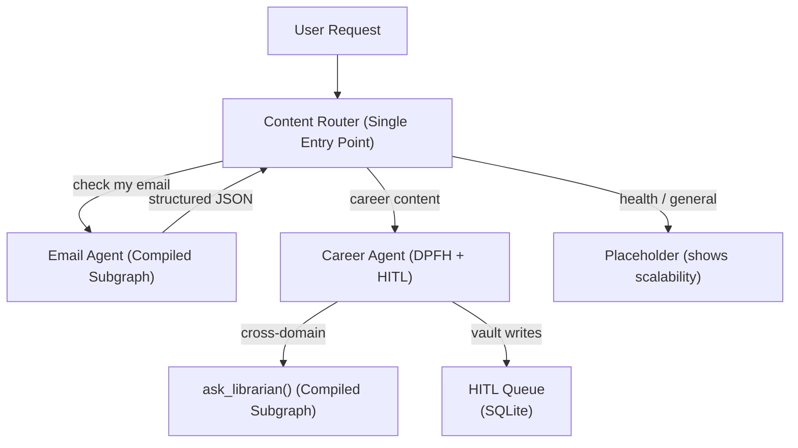

**Back to:** [[Table of Contents#6.1.2. Agentic R&D|Table of Contents]] | [[Project - Nexus Agentic Engine]]

# Overview
This project demonstrates the Nexus Engine's three-agent pipeline: a **Content Router** (classifier + dispatcher), an **Email Agent** (compiled subgraph for email I/O), and a **Career Agent** (domain reasoning with DPFH + HITL). The Router is the single entry point — when it needs email data, it calls the Email Agent subgraph (same compiled subgraph pattern the Career Agent uses to call the Librarian), gets back structured JSON, classifies each email by domain, and dispatches to the Career Agent.

## Demo Pipeline

**Three agents, two compiled subgraph patterns:**
- Router calls `fetch_emails(query)` → Email Agent subgraph → returns JSON
- Career Agent calls `ask_librarian(query)` → Librarian subgraph → returns string

# Objectives
- **Three-Agent Pipeline**: [[Project - Content Router Agent|Router]] (classifier + dispatcher) → [[Project - Email Agent|Email Agent]] (I/O subgraph) → [[Project - Career Agent|Career Agent]] (domain reasoning).
- **Compiled Subgraph Pattern**: Demonstrate inter-agent communication via compiled subgraph tools — a proven, reusable pattern.
- **Live Data Ingestion**: Email Agent pulls real job emails from Gmail via IMAP/XOAUTH2, with a `--mock` fallback.
- **DPFH + HITL**: Career Agent demonstrates Deterministic Pre-flight Hydration and Human-in-the-Loop governance.
- **Robust Evaluation Suite**: Golden Datasets and LLM-as-a-judge tests for all three agents.

# Tasks
## Phase 1: Core Engine Maturation (Nexus Repo)
- [x] Set up `evals/` directory and Golden Dataset test cases natively in the `engine/` directory.
- [x] Configure LangSmith tracing for observability within Nexus.
- [x] Implement real-time Console Tracing & Chat REPL for engine observability (2026-06-01).
- [x] Finish and test **Content Router Agent** classification logic (100% accuracy, 10/10 cases).
- [x] Finalize **Librarian Agent** logic and cross-domain tool boundaries (9.9/10 avg score, 7/7 cases).
- [x] Fix **Career Agent** HITL compliance — hardened `propose_write` trigger rules, added cross-domain file paths, upgraded eval runner with tool-call traces (100% pass rate, 8.0/10 avg score, 3/3 cases) (2026-06-01).
- [x] Expand Career Agent eval dataset from 3 → ~8 cases.
- ~~Evaluate per-agent model config~~ — *Deferred. Current model performs well with hardened prompts.*
- [x] Build **[[Project - Email Agent|Email Agent]]** compiled subgraph — migrate `email_tool.py` to `engine/agents/email/`, add `search_emails`, compile as Router tool.
- [x] Register `fetch_emails()` tool on the Router and update Router prompt for email orchestration.
- [x] Build Email Agent eval suite.
- [x] End-to-end smoke test: User → Router → Email Agent (subgraph) → Router (classifies) → Career Agent.

## Phase 2: The Interview Submission (Standalone Repo)
*Deferred — will be tackled separately after Phase 1 maturation.*

# Resources
- [[Project - Nexus Agentic Engine]]: Master architecture reference.
- [[Project - Email Agent]]: Email I/O compiled subgraph (called by Router).
- [[Project - Content Router Agent]]: Universal Content Router for classifying and dispatching inputs to domain agents.
- [[Project - Librarian Agent]]: Cross-domain search compiled subgraph (called by Career Agent).
- [[Project - Career Agent]]: Domain-specialized task execution with DPFH and HITL.
