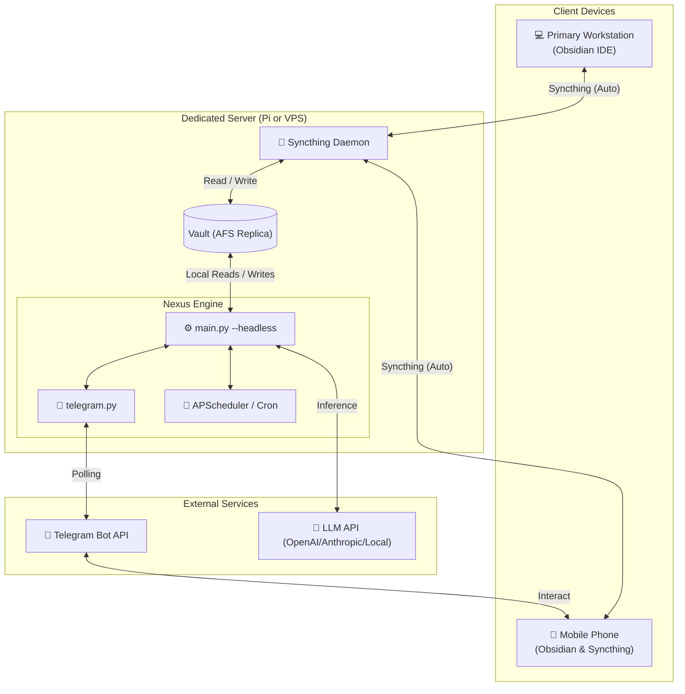

---
aliases:
  - Persistent Hosting
  - Always-On Engine
  - VPS Hosting
  - Raspberry Pi Hosting
tags:
  - projects
  - ai-agents
  - engine-infra
  - server-admin
type: overview
status:
  archived: false
---
**Back to:** [[Table of Contents#6.1.2. Agentic R&D|Table of Contents]] | [[Project - Nexus Agentic Engine]]

## Overview
Build and configure a dedicated, always-on hosting node (Raspberry Pi or VPS) for the Nexus.0 Agentic Engine. This project migrates the background interfaces (primarily the Telegram bot) and automated cron protocols from the user's primary workstation to a persistent local or remote server. This ensures that:
1. The Telegram bot remains responsive and available 24/7 for mobile quick-capture and vault queries.
2. Background engine tasks (e.g., daily activity logging, health audits, email checks) trigger reliably on cadence even when the workstation sleeps.
3. Vault files remain synchronized across all devices in the background using Syncthing.

---

## Objectives
*   **Headless Execution:** Modify the engine entrypoint to support running in a daemonized, headless mode that does not block or crash on terminal standard input.
*   **Bidirectional Sync:** Keep the remote hosting node's Vault in lockstep with the user's phone and workstation.
*   **Scheduled Automations:** Run daily and weekly agent protocols automatically.
*   **Resiliency & Monitoring:** Set up system services with automatic restart policies and log rotations to prevent disk degradation.

---

## 🏗️ Architecture

Below is the orchestration diagram for the Persistent Engine Hosting setup. The remote node runs the Headless Engine and Syncthing in parallel to process inputs, query files, and synchronize updates back to user devices.



---

## Build Order

Before the engine is migrated to persistent hosting, it must be hardened for headless stability. The build order is split into code preparation, host configuration, synchronization, and final daemonization.

### 1. Engine Code Upgrades (Headless Support)
*   [ ] **Add `--headless` CLI Flag:** 
    *   Update [main.py](file:///c:/Users/Willi/Documents/Projects/Brain%202/engine/main.py) to support a `--headless` (or `--bot-only`) flag. 
    *   When this flag is passed, the engine should skip the terminal menu `while True` loop and standard input prompt ([main.py:L76-106](file:///c:/Users/Willi/Documents/Projects/Brain%202/engine/main.py#L76-L106)), running only the background Telegram bot thread and blocking the main thread cleanly (e.g., using `time.sleep()` or waiting on a threading event).
*   [ ] **Structured Logging:**
    *   Ensure all stdout/stderr prints are mirrored or written to a dedicated log file inside `Logs/Engine/` to allow debugging when running without an attached terminal session.

### 2. Synchronization Setup (Syncthing)
*   [ ] **Install Syncthing Daemon:** Install and start Syncthing on the hosting node. Configure it to launch automatically on system boot.
*   [ ] **Pair Node with Devices:** Link the node's Syncthing instance with the primary workstation and mobile devices.
*   [ ] **Configure Vault Sync:** Add the `Vault/` directory to the paired folders. Verify bidirectional synchronization:
    *   Creating a note on the mobile phone should sync to the host node.
    *   An edit made by the bot on the host node should sync back to the phone and workstation.
*   [ ] **Exclude Git Directories:** Ensure the sync configuration ignores `.git/` folders to avoid sync conflicts in the nested git repository (The Nested Heart).

### 3. Server Environment & Configuration
*   [ ] **Configure Virtual Environment:** Establish a Python virtual environment `.venv/` on the dedicated node.
*   [ ] **Install Dependencies:** Replicate the system package layout using `requirements.txt` (or transition to `uv` for speed).
*   [ ] **Secrets Configuration:** 
    *   Create a secure, node-specific `.env` file containing:
        *   `TELEGRAM_BOT_TOKEN`
        *   `ALLOWED_USER_IDS`
        *   LLM API Keys (or local Ollama address mappings)
*   [ ] **Local Inference (Optional):** If using local models, install and start Ollama on the server node, loading target models.

### 4. Background Scheduler
*   [ ] **Establish Cron / Python Scheduler:** 
    *   Integrate a scheduled execution pattern to trigger daily protocols (e.g., compile activity telemetry, scrape incoming job boards, check inbox for captures).
    *   If using Linux `cron`, configure scripts to execute within the context of the `.venv` virtual environment to prevent global package conflicts.

### 5. Daemonization (Systemd Service)
*   [ ] **Create Systemd Service File:** 
    *   Author `/etc/systemd/system/brain-engine.service` targeting the headless main command.
    *   Example configuration:
        ```ini
        [Unit]
        Description=Nexus.0 Agentic Engine Headless Daemon
        After=network.target syncthing.service

        [Service]
        Type=simple
        User=pi
        WorkingDirectory=/home/pi/Projects/Nexus
        ExecStart=/home/pi/Projects/Nexus/.venv/bin/python engine/main.py --headless
        Restart=on-failure
        RestartSec=10
        StandardOutput=journal
        StandardError=journal

        [Install]
        WantedBy=multi-user.target
        ```
*   [ ] **Enable & Start Service:** Enable the service so it runs on system boot. Check runtime status using `systemctl status brain-engine`.
*   [ ] **Configure Log Rotation:** Set up `logrotate` rules for systemd logs or engine log files to prevent micro-SD card wear or server disk exhaustion.

---

## Verification Plan

### Automated Tests
*   Run the Librarian evaluation suite `engine/evals/runner.py` directly on the host node to verify that model routing, tools, and response formatting behave identically in the new environment.

### Manual Verification
1.  **Headless Launch Test:** Execute `python engine/main.py --headless` on the workstation without a TTY (or with stdout/stdin redirected) and ensure it starts the Telegram bot and blocks without throwing an `EOFError`.
2.  **Remote Query Test:** Send a query to the Telegram bot from your mobile phone while your primary workstation is asleep. Verify the bot returns the correct answer using files fetched from the local vault.
3.  **Bidirectional Sync Test:** 
    *   Write a test capture note on your phone. Wait for it to sync.
    *   Ask the bot on Telegram to query/modify that note.
    *   Confirm that the edit is written on the server node and synced back to your phone.
