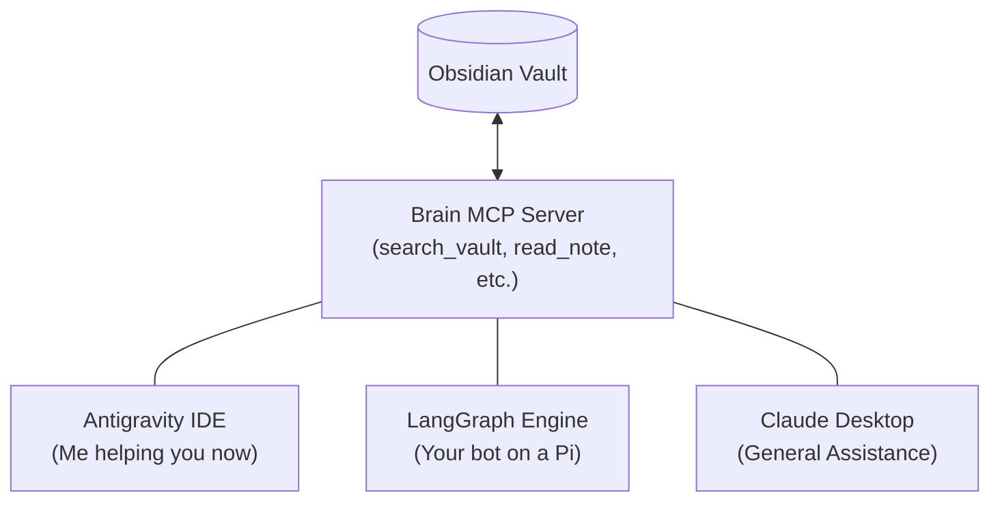

---
aliases:
  - MCP Ideas
  - Agentic Tools
  - MCP Brain OS Tools
tags:
  - ai-agents
  - mcp
  - Nexus
  - projects
type: tool
---
[[Table of Contents#6.1.2. Agentic R&D|Table of Contents]] | **Back to:** [[Project - Nexus Agentic Engine]]

# Workshop - MCP Additions

Implementing **Model Context Protocol (MCP)** standardizes how the Nexus Agentic Engine interacts with the Vault (Agentic File System) and external services. This note serves as a reference for specific MCP tools and servers to build or integrate.

## 1. Core Vault & Knowledge Management
Standardize the "Agentic File System" (AFS) using MCP to ensure interoperability.

- **Vault MCP Server:**
	- `search_vault`: Optimized Zettelkasten search (tags, aliases, link-neighborhood).
	- `read_note_content`: Atomic reading of markdown and YAML frontmatter.
	- `update_metadata`: Tool for targeted YAML updates (tags, type, aliases) without full file rewrites.
	- `enforce_toc`: Validates proposed file paths/names against `Table of Contents.md`.
- **Git-Snap MCP:**
	- `create_snapshot`: Automatically commits/snapshots a file before agent modification.
	- `rollback_change`: Reverts to the previous git state for a specific file.
- **Filesystem MCP:** Standard tools for directory traversal and safe file writing.

## 2. External Content Ingestion
Bridges the gap between the "Second Brain" and the internet.

- **Search MCP:**
	- Brave or Google Search integration for the "Automated Deep-Dive Researcher."
- **Media Transcript MCP:**
	- `get_youtube_transcript`: Refactored `youtube_transcript.py`. Takes a URL, returns a structured transcript.
- **Web Scraper MCP:**
	- Playwright/Puppeteer wrapper for job board scraping (Career Agent) and inventory pricing (StockBot).
- **RSS/News MCP:**
	- Monitors industry trends (e.g., MTEB leaderboard shifts) for the "Intelligence Watchlist."

### 3. Personal Productivity & Communication
Command-and-control tools for the "Life OS."

- **Unified Messaging MCP:**
	- `send_notification`: Sends alerts via Telegram, SMS, or Email.
- **Calendar & Tasks MCP:**
	- Interacts with `To Do List.md` and syncs with external calendars for "Deadline Awareness."
- **Environment Orchestrator MCP:**
	- Prep the workspace by opening relevant notes or triggering local apps/automation.

## 4. Specialized Domain Tools (Agent Teams)
High-leverage bridges for specific agent pods.

- **Clinical/Health MCP:**
	- `parse_medical_xml`: Refactored `medical_xml_parser.py` for HL7/CDA data.
	- Health API Bridge (Apple Health, etc.).
- **Financial/Ledger MCP:**
	- `parse_statement`: Extracts data from CSV/OFX files into structured ledger notes.
- **Career Strategy MCP:**
	- `extract_job_requirements`: Identifies skills from URLs/PDFs.
	- `score_skill_fit`: Diffs job requirements against `My Skills.md`.

## 5. Engine Infrastructure & Observability
Tools for maintaining the "Brain OS" health.

- **Metric-Tracker MCP:**
	- Append-only tool for agents to report success/failure and token usage.
- **Decision Audit MCP:**
	- Logs structured reasoning `{timestamp, agent, decision, reasoning}` to `Logs/Agent Decisions/`.
- **Engine Audit MCP:**
	- Scans workflow logs for infinite loops or anomalous resource consumption.

## 6. Multimedia & Vision
- **Vision MCP:**
	- Wrapper for local VLMs (LLaVA) or GPT-4o for OCR and diagram analysis (screenshot ingestion).
- **Voice Pipeline MCP:**
	- Integration with Whisper (STT) and Edge-TTS (for the Podcast generator tool).

---
## Implementation Strategy
1. **Tool Refactoring:** Move existing standalone scripts (`youtube_transcript.py`, `medical_xml_parser.py`) into MCP-compliant servers.
2. **Standardization:** Ensure all agents use the same `Vault MCP` for any file I/O to maintain the "The Nested Heart" (Git) integrity.
3. **Local-First:** Prioritize local MCP servers (e.g., running via `uvx` or node) to maintain privacy.

## Diagram Example:

