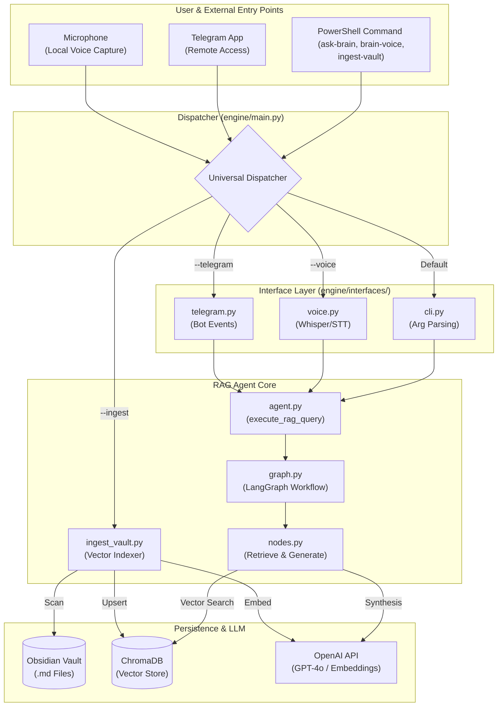

> [!warning] DEPRECATED: Pivot to Agentic Librarian
> We pivoted away from this Vector RAG / ChromaDB architecture on 2026-05-07. 
> **Why?** Context Fragmentation. RAG destroys the hierarchical Zettelkasten structure. An Agentic File Navigator that dynamically uses tools (`read_toc`, `read_note`) to recursively read the physical `.md` files is a superior architecture and a much stronger portfolio piece for Agentic Orchestration.
> This note is preserved for historical record.

**Back to:** [[Table of Contents#6.1.2. Agentic R&D|TOC]] | [[Old Version - Project - Nexus Agentic Engine]]

## Objective
Build a local, privacy-first Retrieval Augmented Generation (RAG) agent natively integrated into the Nexus.0 vault. This agent, triggered by Agentic instruction `/ask_brain` or CLI command `ask-brain`, will allow semantic querying across all vault notes without data leaving the local environment.

## 🏗️ Architecture Overview

The system follows a classic RAG loop orchestrated by **LangGraph**:
1. **Ingestion:** Scan `Vault/`, chunk markdown, generate embeddings, and store in a local Vector DB.
2. **Retrieval:** Convert user query to vector, perform semantic search for top-k chunks.
3. **Synthesis:** Pass retrieved context + user query to a local or API-based LLM.
4. **Response:** Output a grounded answer with citations to the source notes.

## 📂 Project Structure

Transitioned from a flat prototype to a modular architecture for better scalability:

```text
Nexus/
└── engine/
    ├── main.py             # Universal entry point & dispatcher
    ├── ask_brain.py        # Wrapper for CLI backwards compatibility
    ├── ingest_vault.py     # Background worker: chunks & embeds vault notes
    ├── core/               # Shared logic (constants, state)
    ├── agents/             # Domain-specific agents (rag, etc.)
    └── tools/              # Atomic capabilities (chroma, splitting, walking)
```

> [!tip] Query Tip
> Specificity matters. "second thing in my todo list" → no match. "2nd thing in my todo list for one off tasks" → correct answer. More context in the query = better retrieval.

---

## 🗺️ Project Roadmap

### ✅ Phase 1 & 2: Ingestion + Embeddings — COMPLETE
- [x] **Storage:** ChromaDB (local, SQLite-backed, zero-config)
- [x] **Embeddings:** OpenAI `text-embedding-3-small`
- [x] **Chunking:** By H1/H2/H3 markdown headers; whole-file fallback for unheaded notes
- [x] **Token safety:** `tiktoken` truncation to 8000 tokens before embedding
- [x] **IDs:** `MD5(source + section + index)` — collision-safe even with duplicate headers
- [x] Walk `Vault/` recursively, skip audio/image/obsidian dirs.
- [x] First full-vault embedding pass — **1,391 chunks indexed** → `.chroma_db/` (gitignored)

> [!note] Re-run `ingest_vault.py` after adding significant new notes. It uses `upsert` — safe to run anytime.

### ✅ Phase 3: LangGraph Query Agent — COMPLETE
- [x] Define `AgentState` (TypedDict: messages, context, sources)
- [x] Build `retrieve` node — ChromaDB semantic search, top-5 chunks + metadata
- [x] Build `generate` node — GPT-4o synthesis with strict grounded system prompt
- [x] Wire LangGraph: `retrieve → generate → END`
- [x] Add honest fallback — says so instead of hallucinating if no context found
- [x] **Live test passed:** "What were my symptoms at my last doctor visit?" → correctly cited `Visit - 2026_04_08 - PCP Followup.md`

### ✅ Phase 4: Integration & UX — COMPLETE
- [x] Register as `.agents/workflows/ask_brain.md` slash command
- [x] Add Obsidian `obsidian://open` deep links so citations are clickable
- [x] Document Portfolio Pitch for this agent
- [x] Make `ask_brain` feel like a native part of your environment — not a script you have to `cd` into.
	- [x] Add **PowerShell Integration** section to `README.md` with `$PROFILE` setup instructions

### Phase 5: Architectural Modularization (Refactoring) ✅
*Transition from prototype scripts to a scalable engine architecture.*
- [x] **Core Extraction:** Pull shared constants and `AgentState` into `engine/core/`.
- [x] **Tool Modularization:** Extract ChromaDB retrieval and markdown splitting into reusable modules in `engine/tools/`.
- [x] **Agent Specialization:** Encapsulate RAG-specific nodes and graph definitions into `engine/agents/rag/`.
- [x] **Universal Entry Point:** Implement a dispatcher in `engine/main.py` for multi-agent support.

### Phase 6: Voice & Mobile ✅
- [x] **6A — Voice Input:** Custom wrapper (`brain_voice.py`) using `pyaudio` + Whisper, direct piping to `engine/main.py`, and `brain-voice` alias.
- [x] **6B — Telegram Bot:** Dedicated listener (`brain_telegram.py`) with `ALLOWED_USER_IDS` whitelist, `.ogg` voice note support, and multi-turn continuity via `chat_id`.

### Phase 7: Retrieval Quality ✅
*Biggest gap — currently flying blind on answer accuracy.*
- [x] **Eval Framework:** Instead of brittle substring matching, we built `eval_rag.py` using an **LLM-as-a-judge** approach. The script loads a JSON golden dataset (`eval_dataset.json`), runs the queries through the actual LangGraph agent, and prompts an LLM to evaluate if the `expected_criteria` were met. This allows robust testing after major changes.
- [x] **Similarity Thresholding:** ChromaDB's cosine distance (using `text-embedding-3-small`) typically surfaces relevant matches between `0.4` and `0.7`. We introduced a strict `SIMILARITY_THRESHOLD = 0.7` in `core/constants.py` to prevent hallucinating answers from low-quality, "bottom of the barrel" chunks.
- [x] **HyDE (Hypothetical Document Embedding):** Vague user queries (e.g. "What is my current career strategy?") often map poorly to literal markdown chunks. We introduced a `_generate_hyde` function that prompts GPT-4o to write a hypothetical "perfect document" answering the query, concatenates it to the query, and *then* embeds for semantic search. This acts as a bridge from the user's intent to the document's vocabulary.
- [x] **LLM Re-Ranking (`_rerank_docs`):** To avoid heavy, local dependencies like `sentence-transformers` cross-encoders, we implemented an LLM-based re-ranker. We prompt GPT-4o to score retrieved documents from 0-10 on query relevance. We grab the top 5 `RE_RANK_TOP_K` docs, drastically improving the signal-to-noise ratio in the final LLM context window.

### Phase 8: Index Maintenance & Hygiene ✅
*Incremental indexing, orphan cleanup, frontmatter metadata, filtered search, and schema audit.*
- [x] **Incremental indexing** — track file modification times; only re-embed notes newer than last index run
- [x] **Orphan cleanup** — detect and remove ChromaDB entries for notes that no longer exist in the vault (prevent duplicate/broken citations when notes are moved)
- [x] **Frontmatter metadata extraction** — parse YAML `tags`, `type`, `date_modified` and store as ChromaDB filterable metadata
- [x] **Filtered search** — expose metadata filters in `ask_brain.py` (e.g., `--domain health`, `--since 2026`)
- [x] **Schema Foresight Audit** — completed May 2026. Current schema: `source`, `section`, `tags`, `type`, `domain`. Distribution across 1,577 chunks:
	- **Domain coverage:** 60% tagged (health: 244, career: 183, projects: 167, meta: 159, tech: 93, learning: 62, personal/finance: 40). **629 chunks (~40%) have no domain** — mostly notes with generic tags like `index,master` that don't map to a domain. Acceptable for now; these are still retrievable via unfiltered search.
	- **Type normalization needed:** `Article` vs `article` (60 vs 10 chunks) — should be normalized to lowercase in `parse_frontmatter`. Minor, fix on next pass.
	- **Fields evaluated:**

| Field | Verdict | Rationale |
|---|---|---|
| `word_count` | ✅ Add later | Cheap to compute, useful for filtering out stub notes. Not blocking. |
| `date_created` | 🤔 Deferred | Useful for `--since` filtering but requires consistent `date` frontmatter across all notes. Not yet standardized. |
| `confidence` | ❌ Skip | No signal source — would require manual annotation per chunk. |
| `last_verified` | ❌ Skip | Only useful with a fact-checking workflow. Premature. |
| `has_links` | ❌ Skip | Better solved by graph analysis, not RAG metadata. |

### Phase 8.5: Module Ownership Cleanup ✅
*~60% of `core/` and `tools/` is RAG-specific code masquerading as shared infrastructure. Must be resolved before adding agent #2.*
- [x] **Move RAG constants** — `CHROMA_PATH`, `COLLECTION_NAME`, `EMBED_MODEL`, `TOP_K`, `SIMILARITY_THRESHOLD`, `RE_RANK_TOP_K`, `MAX_TOKENS` from `core/constants.py` → `agents/rag/constants.py`
- [x] **Move RAG state** — `AgentState` from `core/state.py` → `agents/rag/state.py` (each agent defines its own state shape)
- [x] **Move RAG tools** — `chroma_tool.py` and most of `text_utils.py` (`split_by_headers`, `make_id`, `truncate_to_token_limit`) from `tools/` → `agents/rag/tools/`
- [x] **Keep shared tools** — `vault_walker.py` stays in `tools/` (any agent may walk the vault)
- [x] **Keep shared core** — `ENGINE_ROOT`, `PROJECT_ROOT`, `VAULT_PATH`, `OPENAI_API_KEY`, `AI_MODEL`, `IGNORE_DIRS` stay in `core/constants.py`

### Phase 9: Structural & Contextual Retrieval 🔴
*Current chunk-based retrieval fails on ordinal/structural queries (e.g., "what is the 3rd item") and long project roadmaps.*
- [ ] **Parent Document Retrieval** — embed small, high-precision chunks for matching, but retrieve the full parent document (or a large surrounding window) for synthesis.
- [ ] **Contextual Chunking** — during ingestion, prepend "Global Context" to every chunk (e.g., "This section is part of the Roadmap in [File Name]") to maintain grounding.
- [ ] **Dynamic TOP_K** — implement a "relevance density" check; if multiple top matches come from the same file, automatically expand the context to the full file.

### Phase 10: Observability 🟡
*No record of what's been asked, retrieved, or answered.*
- [ ] **Query log** — append each query, source files retrieved, and final answer to `engine/query_log.jsonl`
- [ ] **Vault note mirror** — optionally write query log entries as a Obsidian note in `Vault/6. Forge/` for in-Obsidian review
- [ ] **Bad answer flagging** — CLI flag `brain --bad` to mark last answer as incorrect for future eval dataset

### Phase 11: Multi-Turn Conversation 🟡
*Each invocation is currently stateless — no memory between runs.*
- [ ] **Conversation history persistence** — save Q&A pairs to a local `query_log.json` between sessions
- [ ] **Follow-up queries** — load prior context so "what about the one before that?" resolves correctly
- [ ] **Context window management** — prune old turns when conversation grows beyond the LLM's context limit

### Phase 12: Privacy & Air-Gap Mode 🟡
*Currently embeddings require one OpenAI API call per chunk. Full local mode eliminates that.*
- [ ] **Local embeddings** — swap `text-embedding-3-small` for `nomic-embed-text` via Ollama; zero API calls for indexing
- [ ] **Local LLM** — swap GPT-4o for `llama3` via Ollama; fully air-gapped, nothing ever leaves the machine
- [ ] **Config flag** — `--local` flag in `ask_brain.py` that switches both models to their local alternatives

### Phase 13: Record 🟡
- [ ] Update relevant documents regarding this completed project.
	- [ ] README
	- [ ] AGENTS.md
	- [ ] [[Portfolio Hub|Portfolio]]
	- [ ] [[Resume - Master]]
	- [ ] Parent Project: [[Project - Nexus Agentic Engine|Nexus Agentic Engine]]
	- [ ] Others?

---

## 🔬 Technical Watchlist: Models & Tokenizers
*Current setup: OpenAI `text-embedding-3-small` + `tiktoken` (cl100k_base)*

| Model | Tokenizer | Why watch? |
| :--- | :--- | :--- |
| **BGE-M3** | HuggingFace | Multi-lingual, multi-hop, and long-context support. |
| **Nomic Embed v1.5** | Nomic | High-perf 512-dim (Matryoshka) local model. |
| **Jina Embeddings v3** | Jina | Late Interaction support; designed for complex RAG tasks. |
| **Voyage-3** | Voyage | Industry-leading retrieval performance for specialized domains. |

> [!warning] The Tokenizer/Model Marriage
> If swapping models, **you must swap tokenizers.** Using `tiktoken` with a Llama-based embedding model will result in silent retrieval degradation or chunk-limit errors.

---

## 🛠️ Silent Maintenance Debt
*Ongoing operational checks to prevent "Engine Rot".*

- [ ] **Quarterly ID Prune:** Run a script to verify all ChromaDB `source` paths match real files.
- [ ] **Model Drift Audit:** Re-run the "Golden Dataset" baseline after any change to the OpenAI `gpt-4o` or `text-embedding` model version.
- [ ] **Prompt Refresh:** Audit the system prompt in `generate()` node every 6 months to ensure instruction-following hasn't degraded with model updates.
- [ ] **API Deprecation Check:** Check OpenAI developer changelogs for embedding model EOL (End of Life) dates.

---

## 🏛️ Architecture Decisions Log
*Decisions made and why — so we don't re-litigate them later.*

### Alias vs. Slash Command — Have Both (They're Different Things)
- **PowerShell `brain`** = you, at a terminal, asking a direct question. Human → computer.
- **`/ask_brain` slash command** = an AI agent calling it mid-workflow. Agent → tool.
- Same underlying engine, different callers. Not redundant. Like a web app having both a UI and an API.

### Shell Alias Scope — README Only, Not AGENTS.md
- The `$PROFILE` alias contains hardcoded machine paths (`C:\Users\Willi\...`) — useless to anyone else cloning the repo.
- AGENTS.md gets **one tool entry** for `ask_brain.py` (what it is, what it does). No alias mention.
- Shell setup lives in `README.md` under a clearly marked "Brain CLI (Optional, Personal Setup)" section with `<YOUR_PATH>` placeholders.

### Bounded ask_brain Integration — NOT Blanket
- Wiring `ask_brain` into every skill/workflow would add latency, cost, and silent failure risk (if `ingest_vault.py` hasn't been run, every workflow breaks).
- **Only integrate into workflows where vault context is the difference between mediocre and genuinely good output:**
	- ✅ `/analyze_health` — longitudinal history is the whole point; without it, analysis is just vibes.
	- ✅ `/weekly_review` — needs to know what's active, what's stale, what's in the inbox.
	- 🤔 `/add_job_requirement` — could query `My Skills` to auto-detect gaps. Evaluate later.
- Everything else stays simple and self-contained.

### Public Repo Strategy
- `.chroma_db/` — gitignored ✅
- `.env` / API keys — gitignored ✅
- Shell alias — README with placeholders only ✅
- `ingest_vault.py` — documented as a required setup step in README ✅
- ask_brain skill integration — opt-in, not default, so a fresh clone doesn't break ✅
---

## Materials Needed

- **API Keys:** OpenAI API Key (in `.env` — already configured).
- **Dependencies:** `chromadb`, `tiktoken`, `langchain-openai`, `langgraph`, `python-dotenv`
- **Storage:** `.chroma_db/` — currently ~100-200MB for 1,391 chunks (gitignored, not synced).
- **Docs:** [LangGraph Docs](https://langchain-ai.github.io/langgraph/) | [ChromaDB Docs](https://docs.trychroma.com/) | [OpenAI Embeddings](https://platform.openai.com/docs/guides/embeddings)

---

## Reference Links
- **Parent Project:** [[Project - Nexus Agentic Engine]]
- [[Retrieval Augmented Generation (RAG)]]
- [[Vector Databases]]
- [[Multi-Agent Systems & Orchestration]]

---

## 📊 Unified Engine Architecture (v1.13.0)



